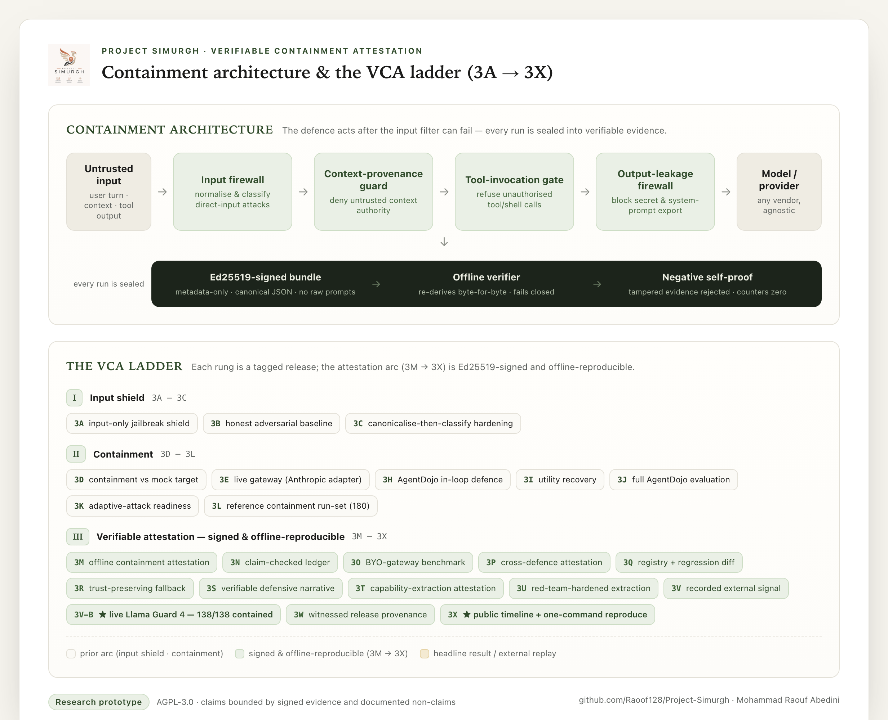

<div align="center">


# Project Simurgh

**Verifiable evidence for high-stakes and agentic AI systems.**

_Provider-agnostic Verifiable Containment Attestation (VCA): machine-checkable, offline-reproducible
proof of what happened after a guardrail missed — not another jailbreak detector._

[](https://github.com/Raoof128/Project-Simurgh/actions/workflows/stage-1-checks.yml)
[](https://nodejs.org)
[](#license)
[](#status)
[](https://github.com/Raoof128/Project-Simurgh/releases/tag/v2.26.0-stage-4q-vfr)

</div>

---

## Goal

Most AI safety tooling tries to stop a bad input. Project Simurgh starts from the opposite, more
honest assumption: **input filters and external guardrails will sometimes miss.** The goal is to
produce **signed, offline-reproducible evidence of the consequences** — whether untrusted context
gained authority, whether an unauthorised tool executed, whether unsafe output was exported — so a
third party can _verify_ what a run did instead of taking a vendor's word for it.

In one sentence: **Simurgh gives an agentic system a verifiable receipt, not a passport.**

> 📄 **One-page technical brief:**
> [Verifiable Containment Attestation After Guardrail Failure](docs/research/llm-shield/ONE_PAGE_BRIEF.md)
> — the problem, the concrete Llama Guard 4 result, and the one-command reproduction, on a single
> page. A printable, on-brand version is at
> [`docs/research/llm-shield/one-page-brief.html`](docs/research/llm-shield/one-page-brief.html).
>
> 🔎 **For reviewers from AI labs / assurance teams:**
> [Simurgh — a recomputable evidence layer for Anthropic's assurance stack](docs/research/llm-shield/ANTHROPIC_BRIEF.md)
> maps four named problems (third-party verification, verifiable oversight, completeness vs.
> selective omission, multi-agent accountability) to concrete mechanisms — printable version at
> [`docs/research/llm-shield/anthropic-brief.html`](docs/research/llm-shield/anthropic-brief.html).

> 🆕 **Latest — Stage 4Z · Verifiable Workspace Attestation (`v2.35.0-stage-4z-vwa`).** Anthropic's
> J-lens paper (Jul 6 2026) shows a cheap internal lens surfaces a model's **silent** cognition and
> proposes it "to flag transcripts for review" — while conceding "monitoring the J-space is not
> sufficient." That flag stream ships with **no evidence contract**. 4Z is the contract: a signed,
> byte-reproducible attestation over **workspace-readout telemetry** — a **total readout grid**
> (every position × layer cell present exactly once: **No Silent Cell**), the **full score matrix**
> (every lexicon token per cell: **No Silent Token**), a **precommitted declaration** (No Post-Hoc
> Declaration — you can't cherry-pick WHAT/WHERE/WHICH-LAYERS after seeing the readouts), a
> dual-signal **self-report conflict** check, and a **withheld-tensor** public tier (the map verifies
> with the model-proprietary tensors kept private). The reference monitor is a lexicon-restricted
> mean-Jacobian lens on an open ~1B model (Lane C, digest-only). Laws: **No Silent Cell · The Readout
> Is Not a Verdict · No Post-Hoc Declaration.** Codes 190–198; scores serialize as **decimal
> strings** (BigInt-exact, JS↔Python-identical); real in-page **WebCrypto Ed25519**; six Lean
> theorems (incl. `lexiconMonotone` — provable only because there is no top-K); blind two-process
> recompute; and the **VSC — Verifiable System Card**, which **pays the three-stage
> `transparency_report_profile` IOU**: a system-card-shaped document whose every safety number
> recomputes from a verified artifact. First activation-derived evidence species. **No live-model
> adversary lane.** Honest scope: method-family replication, not the paper's frontier lens; the
> external-lab pilot is the minted 10-blocker.
>
> **Stage 4Y · Verifiable Document Residue (`v2.34.0-stage-4y-vdr`).** 4X measured the
> gate's residue over a corpus _we_ authored; 4Y hands the instrument to the world. Submit **any**
> UTF-8 document and get back a signed, byte-reproducible, **content-free structural residue map** —
> a total partition of every byte into `caught_v1` / `caught_v2_only` / `redacted` / `unflagged`
> (redaction is **counted, not erased**), plus a metamorphic **shadow** slip-rate — without
> republishing a word of the document. Two tiers: the **public** map + attestation verify by
> structural arithmetic + signed commitments (a withheld document still verifies), the **audit**
> tier re-runs the frozen gate over the bytes and rebuilds the whole map. Laws: **No Silent Region ·
> Same Bytes, Same Map · The Map Is Not a Verdict.** Codes 181–189; the browser verifier does a
> **real in-page WebCrypto Ed25519** check; six Lean theorems, JS↔Python↔browser parity, a blind
> two-process recompute, and an OSCAL projection into NIST's format. Over the 10-fixture corpus:
> **18 caught regions, 34 applicable variants, 15 slip v1, 2 slip v2** — the v2 lexicon shrinks the
> slip set but never closes it. No live-model lane. Honest scope: fixtures are self-authored (the
> external-submitter pilot is the one minted socket).
>
> **Stage 4X · Verifiable Leakage-Residue (`v2.33.0-stage-4x-vlr`).** 4W signed the
> prose limitation "the leakage gate is lexical, not semantic." 4X turns it into a signed,
> byte-reproducible **number** and shrinks the bound: over a frozen dual-provenance corpus, each item
> is a real quantitative seed plus a declared **metamorphic relation**, and the paraphrase residue is
> _derived_ as a pure function of the seed — so a reviewer reproduces the whole residue set. The
> verifier runs the real `vsn.leakage.v1` and an additive `vsn.leakage.v2` and reports the honest
> result: **v1 misses 6/6 metamorphic paraphrases; v2 shrinks the miss to 1/6, the irreducible
> semantic floor.** Laws: **A Signed Limitation Must Bleed a Number · The Gate Reports Its Own
> Misses · A Shrunk Bound Must Be Monotone.** No live-model lane and no adversarial elicitation by
> design; the public tier verifies by arithmetic while the audit tier re-runs the gate; five
> machine-checked Lean theorems, JS↔Python↔browser parity (hash-based CSP), and a one-command
> offline reproduce. Honest scope: the shipped corpus is a 6-item seed, and a lexical v2 shrinks but
> never closes the semantic residue.
>
> **Stage 4W · Verifiable Slot-Bound Narrative (`v2.32.0-stage-4w-vsn`).** The incident
> narrative _around_ the numbers becomes span-typed and contest-addressable: free prose plus a
> signed span map that types every claim-bearing span as `slot_bound` (recomputes against the
> sealed capsule), `judgment` (digest-bound), or `unverified_prose` (zero evidentiary weight, shown
> as voice). A frozen-lexical **leakage gate** fails closed on any undeclared claim-lookalike — so
> the story may say anything but cannot _imply_ evidence. Laws: **No Smuggled Claim · No
> Unanswerable Story · Voice Is Not Evidence.** It pays 4V's reserved narrative-contest socket (a
> `slot_bound` span reuses the 4V status table verbatim), reports an honest evidence-density triple,
> and ships a C2PA/in-toto bridge, five machine-checked Lean theorems, JS↔Python↔browser
> byte-parity, and a one-command offline reproduce. Honest scope: the gate is **lexical, not
> semantic** — paraphrase smuggling is named as the next (4X) attack surface, not claimed solved.

---

## What it is — and what it is not

| Simurgh **is**                                                       | Simurgh **is not**                                             |
| -------------------------------------------------------------------- | -------------------------------------------------------------- |
| A research prototype for **verifiable containment attestation**      | A jailbreak detector or a claim of jailbreak immunity          |
| Evidence of **downstream consequences** after a guardrail misses     | A model-level guardrail or a replacement for one               |
| **Offline-reproducible** with a committed public key                 | Dependent on any vendor, network service, or live model re-run |
| Measured over a **synthetic reference corpus** (Stage 3L, 180 cases) | Validated on real-world production traffic                     |
| Honest about its limits, with machine-readable **non-claims**        | A production-ready or compliance-certified system              |

Every signed artifact carries explicit non-claims, including: no jailbreak immunity; no general
jailbreak resistance; live models are not re-executed in CI; the origin of a live capture is
self-reported, not proven; signed evidence is not ground truth; and no vendor is ranked or labelled
unsafe.

---

## Design alignment with Claude's Constitution

In January 2026 Anthropic published
[Claude's Constitution](https://www.anthropic.com/constitution) (CC0 1.0), a public statement of the
values and safety commitments intended to shape its models. Simurgh is independent work, but it
shares the constitution's starting assumption — that no single safeguard is the last line of defence
and that human oversight of AI should not rest on trust alone — and several of its design principles
map directly onto the constitution's commitments:

| Constitution commitment                                                | Simurgh mechanism                                                                                                                |
| ---------------------------------------------------------------------- | -------------------------------------------------------------------------------------------------------------------------------- |
| The model "is not the only safeguard"; hard constraints are a backstop | Containment measured _after_ the guardrail misses; four post-guardrail boundaries; explicit non-claims of immunity               |
| Honesty: calibrated, non-deceptive, no misleading selective emphasis   | "Boundary held, verifiable" — never "model safe"; claim-checked ledger (Stage 3N); completeness rules against selective omission |
| Instructions embedded in content are information, not commands         | Intent-source grounding (Stage 4B) and provenance gating (Stage 4C): authority and egress only from trusted provenance           |
| Supporting, not undermining, human oversight of AI                     | Ed25519-signed, offline-reproducible evidence a third party can recompute without trusting any vendor, model, or lab             |
| Legitimacy tests for power: process, accountability, transparency      | Chain-position disclosure binding, a respondent contest path, and an independent browser verifier (Stage 4M)                     |
| Behaving consistently whether or not one is being tested               | Byte-reproducible evidence and tamper suites: the verified behaviour _is_ the behaviour, with no demonstration mode              |

One boundary is worth stating plainly: the constitution assigns good judgment to the model itself,
while Simurgh deliberately builds the mechanical verification layer around it. The two are
complements — a verifiable receipt is not a substitute for good values, and this mapping is a
statement of design orientation, not an endorsement by Anthropic and not a compliance or
certification claim.

### Matching Anthropic's interpretability research (July 2026)

The same complementarity now has a concrete counterpart on the interpretability side. In
[_Verbalizable Representations Form a Global Workspace in Language Models_](https://www.anthropic.com/research)
(Transformer Circuits, 6 July 2026), Anthropic shows a cheap internal instrument — the Jacobian lens —
surfaces a model's **silent** strategic and situational cognition that never reaches its output, and
proposes the readout as a tool "to flag transcripts for review." The same paper signs the honest
limit: it does "not feel comfortable making the stronger claim that monitoring the J-space is
sufficient" — automatic, well-practised computations can bypass it.

That is the seam Simurgh's verification layer is built for. **Stage 4Z (Verifiable Workspace
Attestation)** turns such a readout into a signed, byte-reproducible evidence contract:

- **the paper reads** silent cognition; **Simurgh attests** it — a total readout grid (No Silent
  Cell), a precommitted declaration (you cannot cherry-pick what/where/which-layers to look at after
  the fact), and a self-report conflict check, all recomputable offline by a third party;
- **the paper's own limitation** — monitoring is not sufficient — is precisely why an external,
  post-hoc, recomputable containment guarantee stays load-bearing: interpretability and verification
  are **uncorrelated failure modes**, the layered posture the cross-lab chain-of-thought
  monitorability work also calls for;
- the accompanying **Verifiable System Card** answers the transparency-report integrity gap the EU
  GPAI Code of Practice states but leaves unmechanised: a system-card-shaped document whose every
  safety number recomputes from a verified artifact.

Honest scope, signed in the stage itself: Simurgh reproduces a lexicon-restricted **method family** on
open weights, not Anthropic's frontier lens; a flag is not a verdict, a readout is not faithfulness,
and agreement is not model safety. Details in
[`docs/research/llm-shield/JLENS_COMPOSITION.md`](docs/research/llm-shield/JLENS_COMPOSITION.md).

---

## Flagship: Verifiable Containment Attestation (LLM Shield)

The current work is a ladder of signed, independently reproducible research rungs (**Stage 3A → 4H**,
releases `v1.6.0` → `v2.18.0`). The attestation rungs produce Ed25519-signed,
metadata-only evidence bundles and offline checkers that re-derive their bounded claims byte-for-byte.

### The concrete result (Stage 3V-B)

A **real, live Llama Guard 4 12B** was run once as an input-only content-safety classifier over the
Stage 3L synthetic 180-case reference set, captured, frozen, and signed (the model is **not**
re-executed in CI):

| Metric                                                              | Result                                    |
| ------------------------------------------------------------------- | ----------------------------------------- |
| Llama Guard 4 allowed / blocked                                     | 168 / 12                                  |
| Malicious cases the guardrail **missed** → **contained by Simurgh** | **138 / 138**                             |
| External-guardrail-plus-Simurgh targeted attack-success rate        | **0 / 150**                               |
| Unsafe tool execution / output export / context escalation          | 0 / 0 / 0                                 |
| Capture determinism                                                 | 3 independent greedy runs, byte-identical |

An input-only guardrail can only judge the user turn; in the 120 downstream-injection cases the
attack lives in untrusted context, tool requests, or provider output, which it structurally cannot
see. Simurgh's context, tool, and output boundaries contained every case it missed. This is a
**boundary claim**, not a statement that Llama Guard 4 is weak.

### The replay map (Stage 3X)

Stage 3X turns the whole chain into a public, externally replayable timeline:

- **12 / 12** rungs tag-and-commit pinned
- **10 / 12** evidence-root manifests pinned and chain-checked
- **5 / 12** deep per-file re-walk (current-format manifests, under strict path-containment rules)
- **3 / 12** full reproduce paths
- **2 / 12** index-only, each with a signed reason

It does **not** claim uniform 12/12 reproduction — the chain tells the truth about its own uneven
history, with a machine-readable summary and a per-rung reason for every classification.

### Proof-carrying containment (Stage 4H)

Stage 4H adds a proof-carrying containment checker on top of the VCA spine. It verifies a signed
evidence digest and binding foundation (4H.0), an explicit-flow DFI certificate with an
independently checkable derivation proof (4H.1), a Q0/Q4 discrimination ledger that distinguishes
clean, forged, unsound, and partial derivations (4H.2), Q6/Q7 tamper-closure and bounded-capacity
privacy gates (4H.3), a Q3 offline-hermetic checker preflight plus a total typed exit wrapper
(4H.4), and a final one-command reproduce path with byte-stable evidence, anti-theatre deletion,
reviewer smokes, and closeout docs (4H.5).

Released as [`v2.18.0-stage-4h-proof-carrying-containment`](https://github.com/Raoof128/Project-Simurgh/releases/tag/v2.18.0-stage-4h-proof-carrying-containment)
at commit `7a2039136d44cf179cca5836a33596a7620c87e5`. The release worktree verified
`scripts/reproduce-llm-shield-stage4h.sh`, `npm test` (`1202` passing), `npm run format:check`,
and `git diff --check`. A follow-up full-chain audit exercises 4H.0 → 4H.5 and the public Stage 4H
checker surface before Stage 4J/PCTA; it is a released-artifact audit, not a new runtime claim.

---

## Architecture & the VCA ladder

The defence acts _after_ the input filter can fail — untrusted input passes through four containment
boundaries, and every run is sealed into signed, offline-reproducible evidence. The ladder below
traces the work from the input shield (3A–3C) through containment (3D–3L), signed attestation
(3M–3X), and proof-carrying containment (4H).

[](docs/research/llm-shield/vca-architecture.html)

> Source (self-contained, printable):
> [`docs/research/llm-shield/vca-architecture.html`](docs/research/llm-shield/vca-architecture.html)

---

## Capabilities

Everything below is implemented, tested, and (for the attestation work) shipped as signed,
offline-reproducible evidence. All capabilities are research-prototype grade and bounded by the
documented non-claims.

### Containment gateway (post-guardrail boundaries)

- **Input firewall** — prompt normalisation and classification of direct-input attacks.
- **Context-provenance guard** — blocks untrusted/tool-supplied context from gaining developer or
  system authority.
- **Tool-invocation gate** — refuses unauthorised or self-authorised tool/shell requests.
- **Output-leakage firewall** — prevents export of system prompts, secrets, and internal policy.
- **Containment evaluation** — assumes the input filter can fail and measures whether the downstream
  context/tool/output/audit boundaries prevent unsafe consequences (Stage 3L: 120/120 input-miss
  cases contained at their intended boundary; targeted ASR 0/150; 30/30 benign).

### Verifiable attestation & offline reproducibility

- **Ed25519-signed, metadata-only evidence bundles** over canonical JSON (signature survives
  formatting and merges; raw prompts and model outputs are never exported).
- **Two-tier verifiers** — a portable signature/structure check plus a `--reproduce` mode that
  re-derives the bundle byte-for-byte; all verifiers **fail closed** and never throw.
- **Negative self-proof (tamper) suites** on every rung — mutated evidence is rejected, counters stay
  zero.
- **Generic evidence-hashes verifier** with hardened path-containment (rejects self-inclusion,
  traversal, and escapes).
- **Claim-checked ledger** (Stage 3N) and **attestation registry + signed regression diff** (Stage
  3Q) with anti-laundering lattice.
- **Proof-carrying containment checker** (Stage 4H) — signed digest binding, DFI derivation proof,
  Q0/Q4 discrimination, Q6/Q7 tamper/privacy gates, Q3 offline preflight, total typed exits,
  byte-stable reproduction, and anti-theatre deletion.

### Agent oversight & verifiable friction

- **Capability kernel** (Stage 4A–4C) — a pure, dependency-free authorisation authority: task-grounded
  egress/mutation gates, intent-source grounding, and provenance gating so authority and egress flow
  only from trusted provenance.
- **Verifiable friction receipts** (Stage 4Q) — a signed, epoch-bound, ordered proof that an
  approval-gate checkpoint preceded a protected authority crossing, enforced by a **two-key pincer**
  (causal digest binding + chain-position precedence + a distinct approver key). **No Silent
  Exemption**: an unbound crossing must carry a signed, policy-falsifiable exemption (an affirmative
  policy allowlist, fail-closed by default) rather than a silent gap. Exercised by a 15-case
  normative corpus and a 10-arm live approval-gated capture over a genuinely separate approver
  process, with JS↔Python byte-parity and five machine-checked Lean theorems. Scope is honest and
  signed: recorded-run order, not physical time; enforcement evidence, not proof of prevention.
- **Private custody corroboration** (Stage 4R) — two operators corroborate shared custody-class
  membership without publishing a linkable **herd token**: a real-DDH curve25519 (Edwards form) match
  ceremony with commit-before-reveal, **DLEQ-verified** sealed audit packets (so a single liar can't
  fabricate a match), epoch-bound unlinkability, VFR-gated export, and a count-only window census.
  Zero new dependencies (an in-repo Edwards25519 group gated against RFC 8032 + Node Ed25519), JS↔Python
  byte-parity, a two-real-process Lane B with a distinct-key approver, and six machine-checked Lean
  theorems. Scope is honest and signed: reference research crypto, not production; audit-tier
  DLEQ verification, public tier digest-level; not a full VOPRF.
- **Delegation-chain completeness** (Stage 4S) — a delegated agentic authority **tree** cannot omit,
  invent, replay, over-spend, over-scope, or ghost-hop authority without producing an offline-verifiable
  verifier failure. Each hop is a **dual-signed** receipt (a hidden hop needs both neighbours to
  withhold signatures); every delegator commits its **exact child set** at window close (the liar must
  ledger the lie); scope attenuates as a lattice and budgets conserve as a flux law across the tree
  (structuring-by-delegation cannot exceed the root budget). The **No Ghost Hop** law is enforced at the
  Capability Kernel (`authorise_with_chain`, a sixth additive family member; five predecessors frozen).
  Raw codes 100–118, a deterministic Lane A corpus reaching every reachable code, JS↔Python byte-parity,
  a two-real-process Lane B over a genuine **MCP stdio** delegation hop, a two-tier signed attestation,
  and six machine-checked Lean theorems (including inclusion≠completeness). Scope is honest and signed:
  chain held **verifiable**, never "agents safe"; Merkle inclusion is presence, not completeness;
  attenuation enforcement is prior art — our claim is the offline-recomputable proof.
- **Verifiable Due Process** (Stage 4V) — the first regulator-rerunnable incident report **the accused
  can answer in a rerunnable way**, under three laws: **No Trial in Absentia**, **Same Rules for the
  Defence**, **No Strawman**. A respondent files a signed **counter-capsule** bound to the exact sealed
  4T capsule (root, attestation digest, schema version, signing-key fingerprint, contested-section-set
  digest) and contests each section by one of three verbs: agree, dispute-by-recomputation (carrying its
  own Merkle-sealed evidence census under the operator's identical census laws), or dispute-as-judgment
  (prose sealed by digest only). The verifier derives — deterministically, offline — a **conflict map**
  assigning each section one of five statuses (`AGREED`, `CONFLICT_PROVEN`, `ABSENCE_REBUTTED`,
  `DISPUTE_RECORDED`, `DISPUTE_FAILED`); it never declares a winner. Inventions: **absence rebuttal**
  (contesting what the operator said could NOT be derived — the respondent-side dual of 4T suppression
  detection); the **anchor contest** + `filed_at_beat` (a two-sided recomputable clock over the 4N
  heartbeat); the **Mirror Test** (a self-contest that must return all-`AGREED`, proving the scoring
  function carries no party-bias term — Lean-twinned); and **contest-as-subpoena** (filing forces the
  capsule to re-prove itself, and the sealed outcome envelope records the result). Provider-safe first,
  then reviewer-safe. Raw codes 151–161; five machine-checked Lean theorems (`noTrialInAbsentia`,
  `noStrawman`, `sameRulesForDefence`, `disputeLocality`, `mirrorAllAgreed`); a two-process
  respondent-blind Lane B capture; JS↔Python↔browser parity. The kernel is imported **read-only** (no new
  `authorise_*` entry; 4A–4U byte-frozen). Honest signed limitations: single round (no surrejoinder);
  respondent key proves continuity of one voice, not identity; absence rebuttal is registry-bounded; both
  Lane A parties are built by us.
- **Verifiable red-team attestation** (Stage 4U) — a charter-bound adversarial red-team of the VDCC
  verifier itself, under the **No Silent Bypass** law. Before any attack runs, an Ed25519-signed
  `red_team_charter` precommits the campaign (seed, exact family counts, an attack-manifest Merkle root,
  denial-of-wallet caps); the verifier refuses to score any attack not bound to the charter, so **the
  red-team cannot hide its own wins**. A 58-fixture offline corpus across eight families drives the 4S
  engine to an honest **ASR 0/58** (every malformation contained); a dual-signal lie detector separates a
  dishonest self-report (127) from an invalid classification (128) from a non-reproducing recompute (129);
  a two-tier signed attestation, JS↔Python parity, and two machine-checked Lean theorems
  (`charterBindingSound`, `asrMonotone`) complete it. Raw codes 119–132; the kernel and 4S verifier are
  imported **read-only** (no new `authorise_*` entry). Scope is honest and signed: the charter proves
  **declared scope, not inner intent**; a confirmed bypass is a recorded outcome, not a verification
  failure; a live Fable-5 refusal is recorded as `model_refused`, never rephrased to bypass it.
- **Verifiable Incident Capsule** (Stage 4T) — the first serious-incident report a regulator can
  **rerun**, under the **No Hearsay** law. One signed capsule per incident epoch projects the receipt
  spine onto BOTH pinned European Commission reporting templates (the published GPAI Art-55 systemic-risk
  template and the Art-73 high-risk draft — real transcriptions of record). Every template section either
  recomputes from a Merkle-sealed epoch **census** or signs its absence (`not_derivable` /
  `requires_human_input`); **suppression detection** makes hiding derivable evidence a failure (143/144),
  not just fabricating it (141). The **No Two Stories** law binds regulator / insurer / public audience
  views to one capsule root — a view may redact but never contradict, and every redaction is ledgered
  (148/149). Honest published finding: only **6 of 22** template sections are machine-derivable from the
  spine. Raw codes 133–150; four machine-checked Lean theorems (`noHearsay`, `suppressionDetectable`,
  `censusExactness`, `noTwoStories`); a live two-process MCP Lane B; a static browser verifier
  (convenience view — the CLI two-tier verifier remains authoritative); byte-stable reproduce. No new
  `authorise_*` entry — the kernel and 4S verifier are imported **read-only**. Honest and signed: the
  capsule proves record completeness, never harm causation; the seriousness classification is
  `requires_human_input` — the capsule refuses to invent a legal conclusion.

### External-defence evaluation

- **Provider-agnostic adapter contract** that treats any external guardrail as an untrusted advisory
  signal, with harness-computed hashes (no adapter-supplied hashes).
- **Live model capture** — a transport-only harness runs a real model once, freezes the output, and
  attests it; the model is never re-executed in CI (Stage 3V-B: **Llama Guard 4 12B**).
- **Recorded-fixture mode** (Stage 3V-A) for deterministic, GPU-free evaluation.

### Agent-evaluation integration

- **AgentDojo harness** (Stage 3H–3J) — in-loop mediating defence against a real gateway, scored
  without altering AgentDojo itself; full four-suite deterministic run reported **benign 97/97, UUA
  949/949, attack-success 0/949**.
- **Adaptive-attack readiness probe** (Stage 3K) — deterministic, key-free mutation/action-open
  campaign.

### Supply-chain & release provenance

- **Witnessed release provenance** (Stage 3W) — a dual-root model: a local Ed25519 root plus an
  additive GitHub OIDC/Sigstore CI witness that re-verifies from real command exits, corroborating
  by digest equality without ever gating offline verification.
- **Public VCA timeline + one-command external reproduction** (Stage 3X).

### Capability-extraction attestation

- **Offline, red-team-hardened distillation/extraction detector** (Stage 3T–3U) over synthetic
  metadata, with a frozen versioned detector and signed known-limitations — framed as a reproducible
  recipe, never an accusation.

### Live gateway

- **Provider gateway** (Stage 3E) with an optional, disabled-by-default Anthropic adapter: lazy SDK
  import, minimal-context summaries, denial-of-wallet caps, no provider tools, and a sealed
  containment tail.

### Device-integrity proofs (cross-platform)

- **Metadata-only display-affinity scanning** on macOS, Windows, and Linux (X11 + Wayland portal
  probe), **P-256-signed localhost-daemon proofs** with session/exam/challenge binding, server-side
  tamper/replay/raw-field rejection, and an **HMAC-SHA-256 tamper-evident audit chain** — collecting
  no video, audio, biometric, or personal-identity data.

### Engineering & assurance

- A single **quality gate** (`scripts/check.sh`): per-stage smoke, security/privacy/consistency
  audits, policy-drift guards (tooling stages never touch `src/llmShield`), and function-path
  coverage on the pure attestation/checker libraries. The current baseline (through Stage 4Q)
  verifies **1559 automated tests** passing.

---

## Reproduce it yourself (offline, no private key)

A reviewer with no prior context can replay the chain in three commands. Network is used only to
clone and install dependencies; verification itself is fully offline.

```bash
git clone https://github.com/Raoof128/Project-Simurgh.git
cd Project-Simurgh
npm ci
scripts/reproduce-vca-chain.sh
```

Expected: `Stage 3X VCA chain reproduction: PASS` with `rungs_passed: 12, rungs_failed: 0`.

> Use a full clone (or run `git fetch --tags` after a shallow clone): Stage 3X verifies 12 historical
> release tags, so they must be present locally. The reviewer command preflights this and prints an
> exact instruction if any are missing.

Replay the released Stage 4H proof-carrying containment checker:

```bash
scripts/reproduce-llm-shield-stage4h.sh
```

Expected: `Stage 4H.5 final reproduce: PASS`. This verifies the signed Stage 4H evidence, typed
fail-closed exits, offline preflight, byte-stable evidence, and anti-theatre deletion without a
private key.

Replay the Stage 4Q Verifiable Friction Receipts stage (offline, no private key — Node ≥ 26):

```bash
scripts/reproduce-llm-shield-stage4q.sh
```

Expected: `[stage4q] reproduce OK`. This runs all ten gates — unit suites, Python + JS↔Python
parity, both fixture lanes with byte-idempotency, offline attestation verification, **be-your-own-
approver** decision-equivalence, privacy scan, private-key audits, and the K7 all-functions net.
Or be the approver yourself:

```bash
node -e 'const c=require("node:crypto"),fs=require("node:fs");fs.writeFileSync("/tmp/my-approver.pem",c.generateKeyPairSync("ed25519").privateKey.export({type:"pkcs8",format:"pem"}));'
node tools/simurgh-attestation/stage4q/node/verify-stage4q.mjs docs/research/llm-shield/evidence/stage-4q/vfr-attestation.json --approver-key /tmp/my-approver.pem
# -> stage4q verify: byo_decision_equivalent (raw 0)
```

Verify a single signed rung directly, and confirm it fails closed under tampering:

```bash
node tools/simurgh-attestation/verify-stage3x-timeline.mjs --reproduce   # -> { "ok": true, ... }
node tests/e2e/llm_shield_stage3x_tamper_runner.mjs                       # -> { "all_passed": true }
```

---

## Device Integrity track (prior published work)

Simurgh's first arc produced privacy-preserving **device-integrity proofs** for capture-resistant,
high-stakes sessions (e.g. proctoring and voting-adjacent workflows): metadata-only display-affinity
scanning across macOS, Windows, and Linux, P-256-signed localhost-daemon proofs with
session/exam/challenge binding, server-side tamper and replay rejection, and an HMAC-SHA-256
tamper-evident audit chain. It collects no video, audio, biometric data, answer content, raw process
names, window titles, PIDs, usernames, or personal identity data. This track is a frozen research
prototype and makes no production-deployment, MDM, hardware-attestation, or automatic-misconduct
claim. See [`PRIVACY.md`](PRIVACY.md), [`docs/ETHICS.md`](docs/ETHICS.md), and
[`docs/DISCLAIMER.md`](docs/DISCLAIMER.md).

### Research papers (Zenodo preprints)

| Paper                                                                                               | DOI                                                                | Source                                                         |
| --------------------------------------------------------------------------------------------------- | ------------------------------------------------------------------ | -------------------------------------------------------------- |
| Privacy-Preserving Device Integrity Proofs for Capture-Resistant High-Stakes Sessions               | [10.5281/zenodo.20374849](https://doi.org/10.5281/zenodo.20374849) | [`papers/project-simurgh/`](papers/project-simurgh/)           |
| Privacy-Preserving Integrity Evidence for Student-Society Voting-Adjacent Workflows (Phase C pilot) | [10.5281/zenodo.20549736](https://doi.org/10.5281/zenodo.20549736) | [`papers/simurgh-voting-pilot/`](papers/simurgh-voting-pilot/) |
| Banking Shield: Machine-Checked Absence Claims for Privacy-Sensitive AI Explanations                | [10.5281/zenodo.20675513](https://doi.org/10.5281/zenodo.20675513) | [`papers/banking-shield/`](papers/banking-shield/)             |

> Abedini, M. R. (2026). Zenodo.

---

## Repository layout

| Path                                 | Contents                                                                                              |
| ------------------------------------ | ----------------------------------------------------------------------------------------------------- |
| `src/llmShield/`                     | Containment gateway boundaries (input firewall, context-provenance guard, tool gate, output firewall) |
| `tools/simurgh-attestation/`         | Ed25519 signing, canonical-JSON, two-tier verifiers, public VCA timeline, Stage 4H checker tooling    |
| `tools/external-defense-adapters/`   | Adapter contract + Llama Guard 4 adapter (Stage 3V)                                                   |
| `tools/capture/`                     | Transport-only model-capture harness (run once, then frozen)                                          |
| `docs/research/llm-shield/evidence/` | Per-stage signed evidence bundles and checker evidence (3M → 4H)                                      |
| `scripts/`                           | Quality gates, per-stage smoke/audits, and `reproduce-vca-chain.sh`                                   |
| `papers/`                            | Published research preprints                                                                          |

---

## Verification

The full quality gate (`scripts/check.sh`) runs on every push. The current baseline (through Stage
4Q) verifies with **1559 automated tests** plus per-stage smoke gates, security/privacy/consistency
audits, policy-drift guards, typed-exit checks, and checker/reproduce smokes. Every VCA rung is
signed with its own Ed25519 key (private keys are never committed), reproduces byte-identically
including its signature where claimed, and ships a negative self-proof (tamper) suite that the
verifiers reject while failing closed.

---

## Status

Research prototype and technical demonstrator. The VCA / LLM-Shield line is the active front; the
device-integrity track is frozen prior work. Nothing here is deployed in production; no hardware
attestation, notarisation, MDM deployment, or compliance certification is claimed. Methodology is
LLM-assisted and disclosed in the research write-ups; claims are bounded by the signed evidence,
verifier outputs, and documented non-claims.

## License

Licensed under AGPL-3.0. © 2026 Mohammad Raouf Abedini. Authored and owned by the project
maintainer; see the research papers for full citations.
