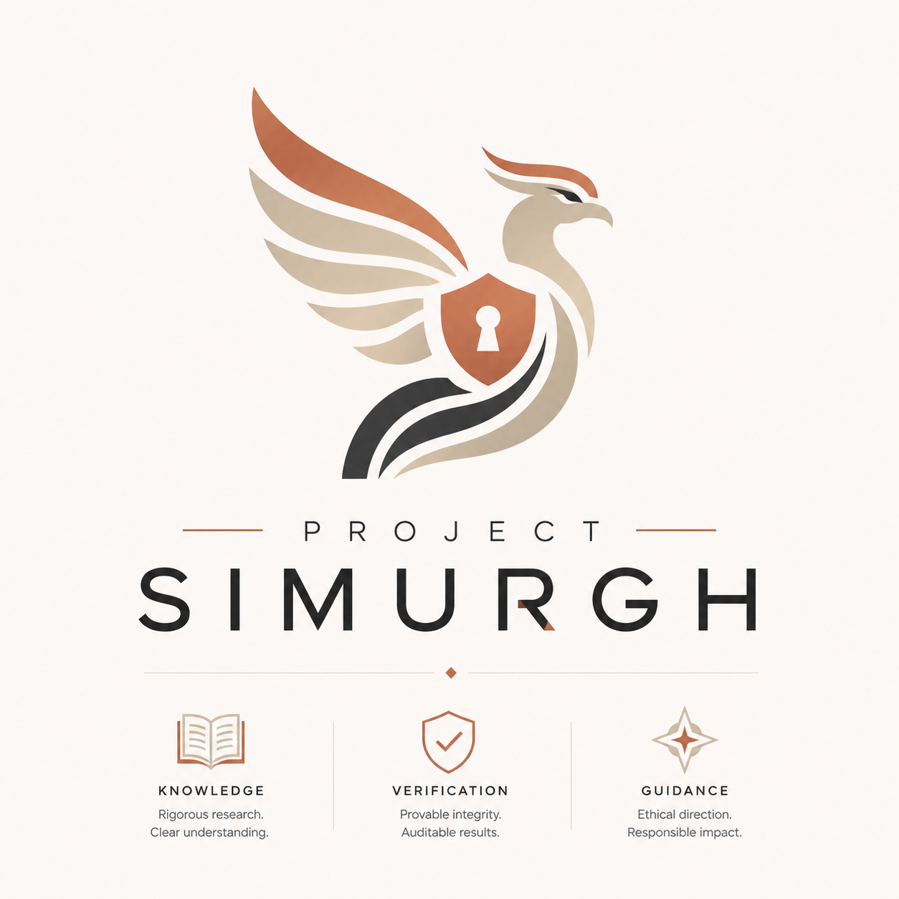
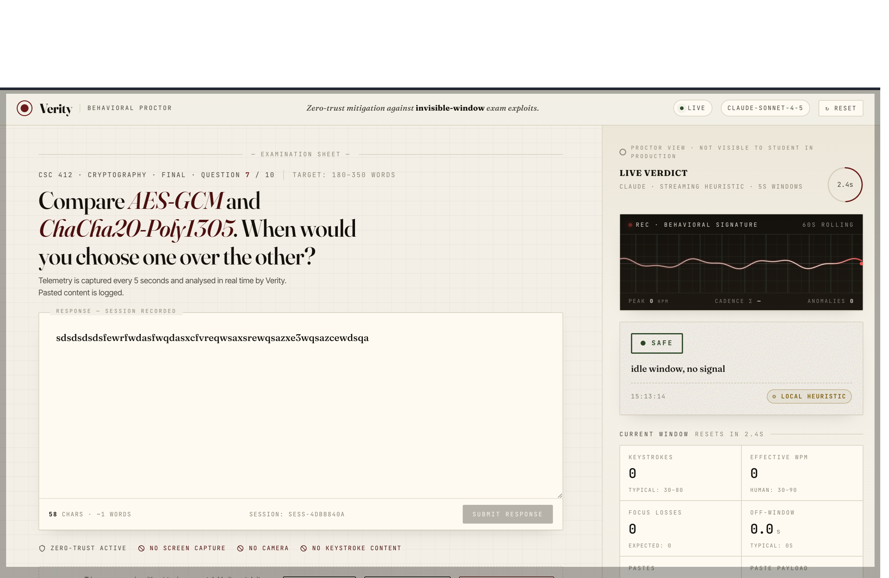
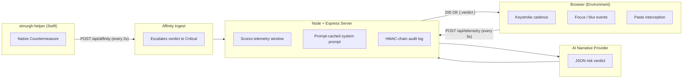
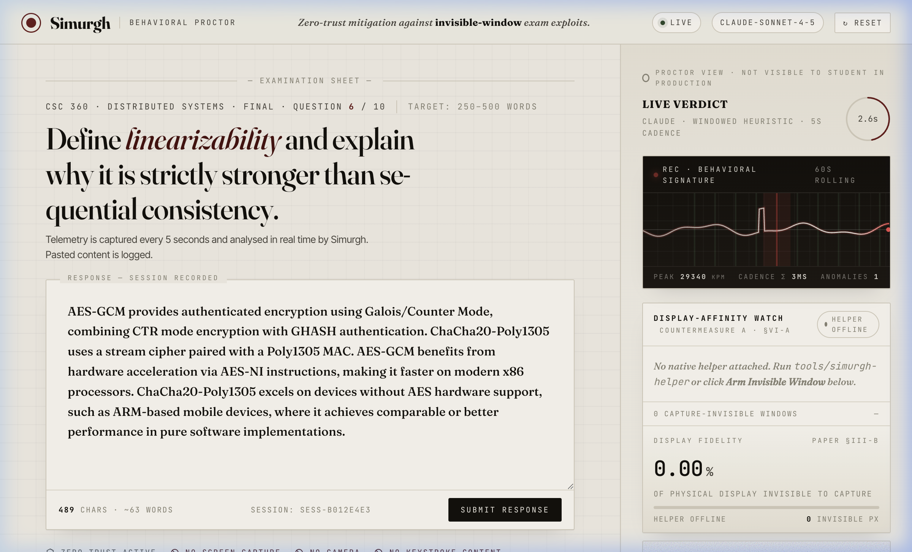
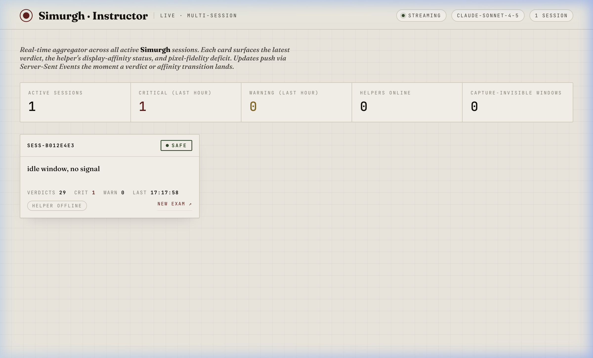

<div align="center">



# Project Simurgh

**Zero-Trust Integrity API for Autonomous Agents and High-Stakes Proctoring**

_Detecting UI-redressing and behavioral spoofing without relying on screen capture._

[](https://github.com/Raoof128/Project-Simurgh/actions/workflows/stage-1-checks.yml)
[](https://doi.org/10.5281/zenodo.20195198)
[](https://nodejs.org)
[](#2-the-simurgh-engine)
[](#13-status--license)
[](#13-status--license)

**[Read the Disclosure Paper →](https://raoufabedini.dev/projects/invisible-window-research)**

<br/>



</div>

## Research Papers

Three Zenodo preprints document Project Simurgh's architecture, its first real-world deployment, and a privacy-firewall pilot. The repository DOI above (`10.5281/zenodo.20195198`) archives the software; the paper DOIs below are separate records.

---

### Architecture Paper

[](https://doi.org/10.5281/zenodo.20374849)

**Project Simurgh: Privacy-Preserving Device Integrity Proofs for Capture-Resistant High-Stakes Sessions**

> Abedini, M. R. (2026). Zenodo. <https://doi.org/10.5281/zenodo.20374849>

Presents the full threat model, system architecture, cryptographic audit-chain design, privacy contract, cross-platform device-integrity implementations (macOS, Windows, Linux), evaluation results, limitations, and ethical deployment boundaries. Companion to the Invisible Window disclosure paper ([10.5281/zenodo.20319832](https://doi.org/10.5281/zenodo.20319832)).

Source: [`papers/project-simurgh/`](papers/project-simurgh/)

---

### Voting-Adjacent Pilot Paper

[](https://doi.org/10.5281/zenodo.20549736)

**Privacy-Preserving Integrity Evidence for Student-Society Voting-Adjacent Workflows: A Phase C Pilot of Project Simurgh at Macquarie University**

> Abedini, M. R. (2026). Zenodo. <https://doi.org/10.5281/zenodo.20549736>

A companion case study reporting a 31-session (30 submitted, 1 withdrawn) Phase C shadow-mode pilot alongside a real student-society voting event at Macquarie University. Demonstrates that structural ballot-field exclusion, an HMAC-SHA-256 audit chain, and a collection-closure posture together produce verifiable evidence of what the system collected and what it did not, in a voting-adjacent context. All 359/359 automated tests, 8/8 smoke gates, 10/10 security-audit gates, and 5/5 closure gates passed at closeout. Archived at tag `v0.5.0-voting-pilot-phase-c-closeout`.

Source: [`papers/simurgh-voting-pilot/`](papers/simurgh-voting-pilot/)

---

### Banking Shield Paper

[](https://doi.org/10.5281/zenodo.20675513)

**Banking Shield: Machine-Checked Absence Claims for Privacy-Sensitive AI Explanations**

> Abedini, M. R. (2026). Zenodo. <https://doi.org/10.5281/zenodo.20675513>

A fictional, non-bank, research-only prototype whose main artifact is bounded _evidence of absence_: gate-backed evidence that sensitive values were not recorded and did not enter an AI-style explanation payload. Combines a fail-closed metadata firewall, per-session tamper-evident HMAC audit chains with withdrawal semantics, and a deterministic offline AI privacy firewall (allowlist input, deterministic mock provider, negation-aware output claim firewall, per-response receipts, static no-egress gate). At the evidence freeze all gates passed (417/417 unit, 43/43 E2E, 27/27 security, three privacy audits) and five trusted internal testers completed 30 formative sessions with zero sensitive values in the evidence. Makes no fraud-detection, payment-safety, compliance, or production-readiness claim.

Source: [`papers/banking-shield/`](papers/banking-shield/)

---

> **Status: Stage 2 Device Shield complete (frozen at `v0.4.18`); current repository baseline `v0.5.0` (voting-pilot Phase C closeout).** Windows Device Shield frozen at `v0.4.13-stage-2-6-2-7-closeout` (real-device validated on Windows 10 Pro build 19045, security-audited). Stage 2.7 unifies macOS and Windows under one cross-platform proof contract. Stage 2.8 Linux Display Integrity Research frozen at `v0.4.16-stage-2-8C-8D-linux-wayland-systemd-ci`. Research paper published on Zenodo ([10.5281/zenodo.20374849](https://doi.org/10.5281/zenodo.20374849)). The system remains a research prototype and does not claim production deployment, MDM/Intune readiness, hardware attestation, kernel-level visibility, or automatic misconduct detection. It does not collect video, audio, biometric data, typed answer content, pasted content, raw process names, raw window titles, HWNDs, PIDs, usernames, serial numbers, MAC addresses, or personal identity data. See [PRIVACY.md](PRIVACY.md), [ETHICS.md](docs/ETHICS.md), and [DISCLAIMER.md](docs/DISCLAIMER.md).

---

## Windows Device Shield Closeout

Stage 2 Windows Device Shield is frozen as a research-prototype baseline. The Windows path includes:

- .NET 8 localhost daemon (`tools/simurgh-daemon-windows/`)
- Metadata-only Win32 display-affinity scanner (`GetWindowDisplayAffinity`)
- Controlled `SimurghAffinityFixture` for local validation
- `WDA_MONITOR` detection → `restricted_detected` / manual review
- `WDA_EXCLUDEFROMCAPTURE` detection → `risk_detected` / Critical floor
- Signed P-256 daemon proofs with session/exam/challenge binding
- Server-side proof validation, tamper and replay rejection
- Recursive raw local-field rejection (`forbidden_local_field`)
- Report, dashboard, and audit integration
- Stage 2.6, Stage 2.7, and closeout smoke coverage
- Stage 2.6/2.7 cybersecurity audit (24/24 tests, nine dimensions)

Validated on Windows 10 Pro build 19045. **Known boundaries:** research prototype only; no production Windows Service deployment; no MDM/Intune readiness; no hardware attestation; no kernel-level visibility; no automatic misconduct finding; no raw HWND, PID, process name, or window title collection. Stage 2.8 Linux Display Integrity Research is frozen through `v0.4.16-stage-2-8C-8D-linux-wayland-systemd-ci`.

---

## Linux Display Integrity Closeout

Stage 2.8 Linux Display Integrity Research is frozen as a research-prototype baseline through `v0.4.16-stage-2-8C-8D-linux-wayland-systemd-ci`.

The Linux path includes:

- Rust axum localhost daemon (`tools/simurgh-daemon-linux/`) on 127.0.0.1:3031
- P-256 ECDSA signed proofs with challenge binding and replay rejection
- X11 scanner: `query_tree` window counting (managed, override-redirect, above-hint, fullscreen, skip-taskbar)
- Wayland portal probe: `NameHasOwner` + `GetProperty<AvailableSourceTypes>` only — no screen capture session initiated
- XWayland partial coverage: `coverage=xwayland_partial`, `xwayland_window_count`
- `display_server_mismatch` enforcement: session-scoped lock, 409 + audit event on mismatch
- `browser_package_hint`: UX-only SDK field, never trusted by server/proof/schema/risk/report
- Dev-only systemd `--user` lifecycle: 4 shellcheck-clean lifecycle scripts, no root/sudo
- Ubuntu CI: `ubuntu-latest`, Xvfb, dbus-x11, shellcheck, `SIMURGH_REQUIRE_XVFB_TESTS=1`
- 16-scenario smoke + 30-assertion cybersecurity audit (16 dimensions)

**Known boundaries:** research prototype only; no production Linux endpoint deployment; no distro packaging; no system-wide service; no MDM readiness; no hardware attestation; no kernel-level visibility; no universal Wayland surface enumeration; no GPU overlay detection; no automatic misconduct detection.

---

## External Technical Review

Project Simurgh Stage 2 (`v0.4.18`) is closed and merged to `main`. It is ready for external technical review.

The current macOS Device Shield baseline includes:

- browser SDK lifecycle integration
- macOS localhost daemon
- Keychain-backed daemon identity
- signed P-256 daemon proofs
- metadata-only CoreGraphics affinity scanning
- report and dashboard device-integrity output
- Stage 2.2/2.3 E2E smoke coverage
- Stage 2.4/2.5 E2E smoke coverage
- Stage 2.5 closeout cybersecurity audit coverage
- Stage 2.6 Windows scanner smoke coverage
- Stage 2.6B real Windows laptop validation for `WDA_MONITOR` and `WDA_EXCLUDEFROMCAPTURE`
- Stage 2.7 cross-platform Device Shield unification (shared `forbiddenLocalFields`, `platformScannerSchema`, `scannerRiskPolicy`; browser SDK `getDeviceShieldStatus()`; cross-platform E2E smoke + security audit; Linux proofs rejected with `unsupported_platform`)
- Stage 2.8A/B Linux X11 scanner + display-server lock + server-side Linux proof acceptance
- Stage 2.8C/D Linux Wayland portal probe (property-read only, no consent triggered) + XWayland partial coverage + `display_server_mismatch` enforcement + dev-only systemd `--user` lifecycle + Ubuntu CI Rust toolchain + mandatory Xvfb + shellcheck
- recursive rejection of forbidden raw local fields
- privacy audit and npm audit gates

**Current verification (`v0.5.0` / `main`):**

- 417/417 Node tests passing
- 33/33 Rust tests passing (`cargo test` with `SIMURGH_REQUIRE_XVFB_TESTS=1`)
- 11/11 Windows .NET daemon tests passing
- 8/8 macOS Swift daemon tests passing
- Stage 2.2/2.3 E2E smoke passing
- Stage 2.4/2.5 E2E smoke passing
- Stage 2.5 closeout security audit passing
- Stage 2.8A/B smoke + cybersecurity audit passing
- Stage 2.8C/D combined smoke (16 scenarios) + cybersecurity audit (30 assertions) passing
- `cargo fmt --check` + `cargo clippy -- -D warnings` clean
- Privacy audit and npm audit passing (0 vulnerabilities)

The project is open for technical review from researchers, engineers, and organisations working on AI safety, enterprise integrity, education trust, agentic workflows, and privacy-preserving secure-session infrastructure.

**Known boundaries:**

- research prototype only — no production deployment claim
- no notarisation or MDM readiness claim
- no hardware attestation claim
- no automatic misconduct finding
- no raw process name or raw window title collection
- no Windows Service, MDM/Intune, or production endpoint-management claim
- Linux Stage 2.8C/D research prototype only — no production Linux endpoint deployment, no distro packaging, no system-wide service, no universal Wayland surface enumeration

**Technical brief:** [`docs/stages/STAGE_2_5_TECHNICAL_BRIEF.md`](docs/stages/STAGE_2_5_TECHNICAL_BRIEF.md) — full Stage 1–2.5 architecture, cryptographic detail, privacy contract, validation gates, limitations, and non-claims.

---

## The Core Philosophy

In Persian mythology, the Simurgh is the ultimate protector of pure knowledge — an entity composed of thirty distinct birds acting as one.

**Project Simurgh** applies this principle to AI and enterprise safety. As frontier models gain "Computer Use" capabilities, they implicitly trust the visual UI. The research paper _The Invisible Window_ (Abedini, 2026) formalizes a structural vulnerability in this assumption. Project Simurgh serves as a decentralized "Shield of Shields," designed to restore ground-truth integrity to browser and OS environments by validating behavioral intent rather than visual output.

---

## Table of Contents

| #   | Section                                                                                        | Description                                       |
| --- | ---------------------------------------------------------------------------------------------- | ------------------------------------------------- |
| 1   | [The Threat: The Invisible Window](#1-the-threat-the-invisible-window)                         | The vulnerability class this project mitigates    |
| 2   | [The Simurgh Engine](#2-the-simurgh-engine)                                                    | Behavioral heuristic architecture                 |
| 3   | [System Architecture](#3-system-architecture)                                                  | Data-flow diagram and component topology          |
| 4   | [Socio-Economic Impact](#4-socio-economic-impact--democratic-access)                           | Bandwidth-inclusive security and privacy ethics   |
| 5   | [Quick Start](#5-quick-start)                                                                  | Installation, configuration, and first run        |
| 6   | [API Reference](#6-api-reference)                                                              | Endpoint specifications                           |
| 7   | [Cost & Latency](#7-cost--latency)                                                             | Prompt-caching economics and response times       |
| 8   | [Security Considerations](#8-security-considerations)                                          | HMAC audit chain and threat model                 |
| 9   | [Stage 1.5 Validation Pack](#9-stage-15-validation-pack)                                       | Reviewer-readiness and evidence map               |
| 10  | [Why AI Platforms Need Proof-Based Integrity](#10-why-ai-platforms-need-proof-based-integrity) | Vendor-neutral platform relevance                 |
| 11  | [Strategic Roadmap](#11-strategic-roadmap-2026---2028)                                         | Four-phase evolution from PoC to Sovereign Shield |
| 12  | [Contributors](#12-contributors)                                                               | Project contributors                              |
| 13  | [Status & License](#13-status--license)                                                        | Current status and licensing                      |

**Implementation-status sections** (narrative, outside the numbered guide):
[The Core Philosophy](#the-core-philosophy) ·
[Simurgh Academic Shield](#simurgh-academic-shield) ·
[Stage 1 Security Hardening](#stage-1-security-hardening) ·
[Windows Device Shield Closeout](#windows-device-shield-closeout) ·
[Linux Display Integrity Closeout](#linux-display-integrity-closeout) ·
[External Technical Review](#external-technical-review)

---

## 1. The Threat: The Invisible Window

A 2026 disclosure (Abedini, R., _The Invisible Window: Exploiting OS-Level Display Affinity to Bypass WebRTC Proctoring Systems_) formalized an attack class against browser-based proctoring and AI UI-vision.

The attack utilizes documented OS-level APIs — Windows `SetWindowDisplayAffinity(WDA_EXCLUDEFROMCAPTURE)` and macOS `NSWindow.SharingType.none` — to render application windows that are fully visible to a physical operator but **produce zero pixels in any output of the W3C `getDisplayMedia()` capture API or AI vision pipelines**.

Consequently, visual verification at the browser layer is structurally broken. Whether mitigating academic dishonesty or preventing hostile overlays from deceiving autonomous agents, the visual channel cannot be inherently trusted.

---

## 2. The Simurgh Engine

The active heuristic engine bypasses the visual channel entirely, evaluating the underlying behavioral footprint. Every five seconds, the client environment samples a **behavioral telemetry window** — a lightweight JSON payload (~2 KB) containing:

| Field                  | Type    | Purpose                                 |
| ---------------------- | ------- | --------------------------------------- |
| `keystrokes`           | `int`   | Raw key-down count in window            |
| `chars_typed`          | `int`   | Characters entered (excludes modifiers) |
| `effective_wpm`        | `float` | Words per minute, normalized            |
| `focus_losses`         | `int`   | `blur` events on the exam tab           |
| `time_off_window_ms`   | `int`   | Cumulative time with focus elsewhere    |
| `pastes`               | `int`   | `paste` events intercepted              |
| `paste_payload_chars`  | `int`   | Total characters pasted                 |
| `max_idle_gap_ms`      | `int`   | Longest inter-keystroke interval        |
| `keydown_intervals_ms` | `int[]` | Raw inter-key timing array              |

This telemetry is securely transmitted to a Node/Express server, which can call a configured AI narrative provider using a prompt-cached system prompt that encodes the threat model.

> **Illustrative scenario:** A screen recording appears pristine, yet telemetry reveals a 4-second focus loss followed by a 1,247-character paste. The visual feed is compromised. The Simurgh engine identifies this discrepancy and escalates the risk verdict accordingly.

### Explicit Limitations & Countermeasures

The behavioral engine cannot natively detect click-through GPU overlays (e.g., Cluely, Interview Coder), as they do not trigger focus-loss events. To address this vector, Simurgh deploys a native counterpart (`simurgh-helper`) that enumerates display-affinity flags directly at the OS level. See Section 3 for the data-flow integration.

> **Capability-uplift context:** The cross-platform exploits documented in the disclosure paper were built with frontier AI coding assistance in a single research session by a student with no prior Win32 or ScreenCaptureKit experience — a self-contained capability-uplift case study relevant to AI platform safety work (see Paper, Section VIII-G).

---

## 3. System Architecture



### Component Summary

| Component                 | Language          | Role                                                                           |
| ------------------------- | ----------------- | ------------------------------------------------------------------------------ |
| **Browser Client**        | JavaScript        | Collects behavioral telemetry; renders verdict overlay                         |
| **Server**                | Node.js / Express | Scores telemetry, optionally requests AI narrative, maintains HMAC audit chain |
| **AI Narrative Provider** | Configured API    | Provides optional explanations for Warning/Critical review cases               |
| **simurgh-helper**        | Swift (macOS)     | Native agent; reports metadata-only display-affinity risk summaries            |
| **Instructor Dashboard**  | HTML / SSE        | Real-time multi-session monitoring and audit export                            |

### Why Prompt Caching Matters

The system prompt encoding the threat model is ~700 tokens and does not change across windows. Provider-side prompt caching, where available, keeps repeated narrative calls cheaper than cold invocations.

---

## Simurgh Academic Shield

Stage 1 extends the core behavioural telemetry engine into a complete **privacy-first academic integrity workflow**.

**What it adds:**

| Capability         | Detail                                                                                         |
| ------------------ | ---------------------------------------------------------------------------------------------- |
| Exam lifecycle     | `POST /api/exams` → join → privacy-accept → start → submit                                     |
| Identity privacy   | Student IDs are SHA-256 hashed — raw names never stored                                        |
| Local risk scoring | Weighted category model (paste, focus, typing, idle, affinity, helper, session)                |
| AI narrative       | Called only on Warning/Critical; fail-open (local score stands if the provider is unavailable) |
| Academic events    | Named taxonomy (BULK_PASTE, FOCUS_LOSS, CAPTURE_EXCLUDED_WINDOW, etc.)                         |
| JSON report export | `GET /api/sessions/:id/report` — includes timeline, risk summary, audit validity               |
| Audit verification | `GET /api/audit/:sessionId/verify` — HMAC chain integrity check                                |

**Privacy commitment:** Simurgh collects behavioural metadata only. No screen pixels, no webcam frames, no typed content, no paste content. Risk scores are heuristic-based. Any anomaly recommendation requires manual human review — Simurgh never makes automatic misconduct findings.

---

## Stage 1 Security Hardening

Simurgh Stage 1 is **privacy-preserving, tamper-evident, hardened, and auditable against the Stage 1 threat model**. It is not "unhackable" — no system is — but every documented gap has a deliberate countermeasure.

### Authentication boundaries

| Boundary                                                                            | Required                  | Mechanism                                                          |
| ----------------------------------------------------------------------------------- | ------------------------- | ------------------------------------------------------------------ |
| Instructor APIs (`/api/sessions`, `/report`, `/audit/:sessionId/verify`, SSE, etc.) | Bearer token              | `SIMURGH_INSTRUCTOR_TOKEN`, validated by `requireInstructorAuth`   |
| Native helper (`/api/affinity`)                                                     | Shared secret header      | `SIMURGH_HELPER_SECRET`                                            |
| Student lifecycle (`privacy-accept`, `start`, `submit`)                             | HMAC session token        | Issued at `/api/exams/:id/join`, verified by `requireSessionToken` |
| Student telemetry (joined sessions)                                                 | HMAC session token        | Bound to sessionId; rejected on mismatch                           |
| Student telemetry (anonymous demo)                                                  | Replay guard + rate limit | No identity binding required                                       |

Four separate secrets in production: `SIMURGH_INSTRUCTOR_TOKEN`, `SIMURGH_HELPER_SECRET`, `SIMURGH_AUDIT_SECRET`, `SIMURGH_SESSION_SIGNING_SECRET`. The server refuses to start in non-demo mode if any are missing.

### Replay and tamper protection

Every joined-session telemetry POST carries `sequence` and `timestamp`. The server rejects:

- Duplicate or rolled-back sequences (`sequence_replay_or_rollback`)
- Timestamps more than 30 s in the past (`timestamp_stale`)
- Timestamps more than 5 s in the future (`timestamp_in_future`)
- Negative numbers, `NaN`, `Infinity`, or values more than 2× over the documented field max
- Payloads larger than 32 KB (`SIMURGH_JSON_LIMIT` configurable)

### Rate limits

| Endpoint                       | Limit                 | Key                  |
| ------------------------------ | --------------------- | -------------------- |
| `/api/exams/:id/join`          | 10/min                | per IP               |
| `/api/affinity`                | 60/min                | per helper secret    |
| `/api/sessions`                | 60/min                | per instructor token |
| `/api/sessions/:id/report`     | 20/min                | per instructor token |
| `/api/audit/:sessionId/verify` | 20/min                | per instructor token |
| `/api/telemetry`               | 3 burst / 1 per 2.5 s | per session          |

### HTTP security headers

`X-Frame-Options: DENY`, `X-Content-Type-Options: nosniff`, `Referrer-Policy: strict-origin-when-cross-origin`, `Permissions-Policy: camera=(), microphone=(), geolocation=()`, `Strict-Transport-Security` (production).

### Tamper-evident audit chain

Every academic event is appended to an HMAC-SHA256 linked chain. Any modification of a prior entry invalidates the signatures of every downstream entry. Verified end-to-end via `GET /api/audit/:sessionId/verify`.

### Stage 1 Verification

Every push to `main` and every pull request runs the full Stage 1 quality gate as a GitHub Actions workflow ([.github/workflows/stage-1-checks.yml](.github/workflows/stage-1-checks.yml)) — same script, same checks. The badge at the top of this file reflects the current status of `main`.

Run the suite locally before pushing:

```bash
./scripts/check.sh              # full pre-push check (Stage 2.5 adds scanner proof/risk/report + E2E smoke gates)
./scripts/check.sh --quick      # pre-commit (skips server boot + chain self-test, ~3s)
./scripts/check.sh --fix        # auto-format with Prettier instead of check
./scripts/check.sh --verbose    # stream command output instead of writing to logs
./scripts/smoke-stage-2-2-2-3.sh # Stage 2.2/2.3 E2E smoke: pairing + daemon proof bridge
./scripts/smoke-stage-2-4-2-5.sh # Stage 2.4/2.5 E2E smoke: SDK + daemon + scanner + signed proof
./scripts/smoke-stage-2-6-windows-scanner.sh # Stage 2.6 E2E smoke: signed Windows scanner proof contract
./scripts/smoke-stage-2-7-cross-platform-device-shield.sh # Stage 2.7 E2E smoke: macOS + Windows scenarios A-G
./scripts/security-audit-stage-2-7-cross-platform-device-shield.sh # Stage 2.7 security audit gate
```

The script enforces: Node >= 22, JS syntax, Prettier format, unit tests, privacy audit (CLI + composite field grep + forbidden npm packages), secret scan, tone check, `npm audit`, server boot + auth gates + security headers + replay rejection, audit chain build/verify round-trip, Stage 2 integrity and daemon gates, browser SDK loading/tests, LaunchAgent plist lint, Stage 2.5 scanner proof/risk/report tests, the Stage 2.2/2.3 and Stage 2.4/2.5 E2E smoke packs, Stage 2.6 Windows scanner smoke and .NET daemon tests when the SDK is available, Swift build/test, and git state. Failed steps write a tail of their log to `.simurgh_check_logs/`.

Individual checks can also be run directly:

```bash
node tools/privacy-audit.mjs                      # privacy audit
npm test                                          # full unit suite
node tools/verify-audit.mjs simurgh-audit-*.json  # verify an exported chain
npm run format:check                              # Prettier check
npm run format                                    # Prettier write
```

### Stage 2.1 macOS Integrity Node (merged — v0.4.1)

Stage 2.1 adds a v1 signed-integrity-proof pipeline. A macOS Swift CLI under `tools/simurgh-node-macos/` generates an Ed25519 keypair, builds a metadata-only proof envelope, signs the canonical JSON, and prints it to stdout. The Simurgh server accepts the proof at `POST /api/integrity/proofs` with `signature_status: "unregistered_node"` until pairing lands in Stage 2.2. A cross-implementation golden fixture locks canonical-JSON byte equality between Node and Swift. Design spec: [`docs/superpowers/specs/2026-05-14-stage-2-1-macos-integrity-proof-design.md`](docs/superpowers/specs/2026-05-14-stage-2-1-macos-integrity-proof-design.md).

### Stage 2.2 macOS Node Pairing (merged — v0.4.2, hardened in v0.4.3)

Stage 2.2 binds a browser exam session to a macOS node public key. The server issues a one-time 32-byte challenge via `POST /api/integrity/pairing/challenge`; the macOS CLI's `pair` subcommand signs the canonical pairing payload; `POST /api/integrity/pairing/complete` records the node's public key. Subsequent integrity proofs from the registered node return `signature_status: "verified"`. Stage 2.1 unpaired flow remains backward-compatible. The v0.4.3 hardening pass added a 30/min rate limiter on `/api/integrity/proofs`, cryptographically-reconciled audit hints (`safeParsedPairingHints`), and a constant-time challenge compare in the pairing registry. Design spec: [`docs/superpowers/specs/2026-05-14-stage-2-2-macos-node-pairing-design.md`](docs/superpowers/specs/2026-05-14-stage-2-2-macos-node-pairing-design.md).

### Stage 2.3 macOS Localhost Daemon (merged — v0.4.5)

Stage 2.3 adds a macOS localhost daemon under `tools/simurgh-daemon-macos/`. The browser probes `127.0.0.1:3031`, requests server challenges from `POST /api/device/challenge`, pairs the daemon through `POST /api/device/pair`, and can attach signed `daemon_proof` metadata to `POST /api/telemetry`. The server verifies P-256 signatures, rejects replayed challenges, updates `daemon_risk`, appends daemon audit events, and includes `device_integrity` in reports. Design doc: [`docs/stages/STAGE_2_3_MACOS_LOCALHOST_DAEMON.md`](docs/stages/STAGE_2_3_MACOS_LOCALHOST_DAEMON.md).

Stage 2.2/2.3 closeout can be run independently:

```bash
./scripts/smoke-stage-2-2-2-3.sh
```

The smoke starts daemon-optional and daemon-required demo servers, verifies Ed25519 node pairing and verified integrity proofs, rejects different-node proofs, stale proofs, nonce replay, invalid signatures, pairs a deterministic mock P-256 daemon, verifies signed daemon proof telemetry, rejects replayed/tampered daemon proofs, checks report/dashboard `device_integrity`, verifies audit chains, and confirms `SIMURGH_REQUIRE_DAEMON=true` still rejects missing daemon proofs with `DAEMON_MISSING`.

### Stage 2.4 Browser SDK & Daemon Lifecycle Hardening (merged — v0.4.6)

Stage 2.4 extracts the browser daemon bridge into [`public/sdk/simurgh-browser-sdk.js`](public/sdk/simurgh-browser-sdk.js). The student page consumes the SDK for daemon discovery, pairing, proof fetch, telemetry send, hardened missing-proof handling, proof-rejection state, and retry-safe local status. The macOS daemon now exposes development lifecycle commands: `start`, `stop`, `status`, `doctor`, and `reset-identity`.

Development LaunchAgent helpers live under `tools/simurgh-daemon-macos/launchd/` and `tools/simurgh-daemon-macos/scripts/`:

```bash
cd tools/simurgh-daemon-macos
./scripts/install-launch-agent.sh
./scripts/uninstall-launch-agent.sh
```

This LaunchAgent path is development-only. It is not notarised, not production endpoint management, and not MDM deployment.

### Stage 2.5 macOS Affinity Scanner + Closeout (frozen — v0.4.10)

Stage 2.5 replaces the daemon's conservative placeholder scanner with a real CoreGraphics-backed, metadata-only scanner. The scanner enumerates visible window metadata, filters tiny/system noise, counts capture-excluded visible windows conservatively, and attaches only aggregate scanner summaries inside signed daemon proofs.

The server accepts validated scanner fields, rejects forbidden raw local fields, escalates `capture_excluded_window_count > 0` to Critical/manual review, and records privacy-safe scanner audit events. Reports and the instructor dashboard now expose scanner state, visible-window count, maximum capture-excluded count, and manual-review wording. Design doc: [`docs/stages/STAGE_2_5_MACOS_AFFINITY_SCANNER.md`](docs/stages/STAGE_2_5_MACOS_AFFINITY_SCANNER.md).

Stage 2.5 closeout includes a dedicated E2E smoke pack:

```bash
./scripts/smoke-stage-2-4-2-5.sh
```

The smoke starts daemon-optional and daemon-required demo servers, imports the browser SDK, pairs a deterministic mock daemon, submits signed healthy and capture-excluded scanner proofs, rejects tampered/replayed/raw-field proofs, verifies report `device_integrity`, verifies the audit chain, and runs the privacy audit. On macOS with Swift available it also builds/tests the real daemon, starts the localhost daemon, checks `/health` and `/status`, runs privacy-safe `doctor`, and performs a safe LaunchAgent boundary/plist check. It does not install production services and does not claim notarisation, MDM readiness, hardware attestation, or automatic misconduct detection.

Stage 2.5 closeout also includes a cybersecurity audit gate:

```bash
./scripts/security-audit-stage-2-4-2-5.sh
```

The audit gate verifies recursive raw local-data rejection, SDK token and proof boundaries, daemon loopback/body/method/malformed JSON/origin guards, LaunchAgent dry-run safety, dashboard/report wording, the Stage 2.4/2.5 smoke pack, privacy audit, npm audit, and macOS Swift daemon test/build/doctor redaction checks when available. Details: [`docs/stages/STAGE_2_5_CLOSEOUT_SECURITY_AUDIT.md`](docs/stages/STAGE_2_5_CLOSEOUT_SECURITY_AUDIT.md).

### Dashboard

- Instructor token is stripped from the URL on page load via `history.replaceState` (no leak into history or referrer)
- Report/verify calls use the `Authorization` header — no token in query string
- All dynamic rendering uses HTML-escaped strings; no unescaped untrusted data interpolation

### Honest limitations (from the research paper §VI-C)

- **Click-through overlays** (`WS_EX_TRANSPARENT`, `ignoresMouseEvents`) do not fire focus events. Pair Simurgh with the native helper (Countermeasure A).
- **Read-don't-paste workflows** — silent transcription at human WPM with no paste — cannot be detected from telemetry alone. Documented in `SECURITY.md`.
- **GPU-layer overlays** (DirectX/Metal hooks) — Stage 4 research track.

The privacy audit, tamper test, and replay test scripts MUST pass before any deployment to a shared environment. See `SECURITY.md` for the disclosure process.

---

## 4. Socio-Economic Impact & Democratic Access

Current proctoring standards (CodeSignal, ProctorU, Examity) are architected for high-bandwidth environments. Project Simurgh intentionally disrupts this paradigm by prioritizing **Bandwidth-Inclusive Security**.

### Bridging the Digital Divide

Traditional proctoring requires continuous, high-speed video streaming. This effectively excludes students in remote villages, developing nations, and rural regions (e.g., Regional Australia, the Global South) where bandwidth is a structural constraint.

**The Simurgh approach:** By transmitting a lightweight behavioral JSON payload (~2 KB per window) instead of a continuous HD video stream, a student on a constrained connection can be evaluated on the same signal as a student on high-speed fibre. By payload size, the bandwidth requirement is roughly three orders of magnitude lower than continuous HD video (≈2 KB per 5 s versus a multi-Mbps stream) — an architectural property of the design, not a measured field benchmark.

### Privacy-as-Code vs. Privacy-as-Surveillance

Video-based remote proctoring has drawn sustained criticism for invasive data collection and for the psychological burden of continuous observation, which the literature suggests can disproportionately affect neurodivergent and socioeconomically disadvantaged students. Project Simurgh's zero-visual approach removes the camera and screen-recording channel entirely, collecting behavioral metadata only. (This is a design rationale, not a controlled comparative study.)

### Cross-Platform Coverage Compared with Legacy Lockdown Software

A widely deployed lockdown tool, Safe Exam Browser (SEB), originated on Windows; its macOS and Linux clients are more limited and it offers no mobile client. Architecturally it follows a _lockdown_ model — restricting what the environment can do — rather than the _behavioral-verification_ model Project Simurgh explores. The two approaches are complementary as much as competing: lockdown constrains the environment, whereas Simurgh derives an integrity signal from behavior, which lets it span platforms a lockdown client does not reach.

Because Simurgh derives its integrity signal from lightweight behavioral telemetry transmitted over a standard browser session — rather than from OS-level lockdown — it is largely **platform-agnostic**:

| Platform     | SEB Support       | Simurgh Support                             |
| ------------ | ----------------- | ------------------------------------------- |
| Windows      | Partial (primary) | ✅ Full (browser-based telemetry)           |
| macOS        | Limited           | ✅ Full (browser + native `simurgh-helper`) |
| Linux        | Experimental      | ✅ Full (browser-based telemetry)           |
| iOS / iPadOS | ❌ None           | ✅ Roadmap (browser-based)                  |
| Android      | ❌ None           | ✅ Roadmap (browser-based)                  |
| ChromeOS     | ❌ None           | ✅ Roadmap (browser-based)                  |

By decoupling integrity verification from the operating system's lockdown capabilities, Simurgh enables a single, unified API to serve every device a student or agent might use — without requiring platform-specific client installations.

### Zero Client-Side Compute — Device Inclusivity by Design

Traditional proctoring platforms impose significant hardware demands: continuous video encoding, real-time screen capture processing, and local AI inference all require modern CPUs, dedicated GPUs, and substantial RAM. Students with older or lower-specification devices are systematically disadvantaged — or outright excluded.

Project Simurgh eliminates this barrier entirely. **All intelligence resides server-side.** The client's only responsibility is collecting lightweight behavioral events (keystrokes, focus changes, paste events) and transmitting a ~2 KB JSON payload every five seconds. Optional narrative analysis can run through the configured AI provider while the deterministic local score remains authoritative. As a result:

- **No video or images ever leave the student's device.** The system transmits only anonymized behavioral metadata — never pixels, never frames, never recordings of the student's environment.
- **No local AI inference is required.** The device does not need a GPU, does not need to run a machine learning model, and does not need to encode or decode video streams.
- **Any device with a browser can participate.** A student using a five-year-old laptop, a budget Chromebook, or even a mobile phone maintains the same integrity verification quality as a student on a high-end workstation. Hardware inequality does not translate into assessment inequality.

### Institutional Cost Reduction

Beyond software licensing, examination integrity carries recurring operational costs: human invigilators, physical examination venues, and the logistics of large-scale in-person supervision. A behavioral-API model can in principle reduce several of these line items:

- Less reliance on dedicated examination halls and their booking, maintenance, and scheduling overhead.
- Lower per-session invigilation cost — fewer staff to recruit, train, and roster.
- No continuous video ingest, storage, or review pipeline, which is the dominant infrastructure cost of traditional video-based remote proctoring. (Separately, where the optional AI narrative is used, provider-side prompt caching reduces that call's token cost — see §7; the two savings are distinct.)

The intended effect is to move integrity verification from a recurring, supervision-heavy expense toward a lower-cost, API-driven dependency. These are design-level expectations; the prototype has not been costed in a production institutional deployment, so no specific savings percentage is claimed.

### Public Health Resilience

Large-scale in-person examinations concentrate hundreds of individuals in enclosed venues for extended periods — creating significant epidemiological risk vectors during seasonal influenza outbreaks, respiratory pandemics (as demonstrated by COVID-19), and other communicable disease events. Institutions are frequently forced to choose between maintaining assessment schedules and protecting student and staff health.

Project Simurgh helps ease this trade-off. By supporting remote examination without visual surveillance, institutions can maintain assessment continuity while reducing the need for physical congregation. Students complete examinations from their own environments, lowering the public-health exposure of large in-person gatherings. This frames behavioral integrity verification not only as a cost question but as a contributor to institutional resilience.

---

## 5. Quick Start

### Prerequisites

- Node.js ≥ 22.0 (matches CI and `scripts/check.sh`)
- AI provider API key for optional narrative integration (current env var: `ANTHROPIC_API_KEY`)
- Xcode Command Line Tools (macOS — for building the native helper)

### Installation

```bash
git clone https://github.com/Raoof128/Project-Simurgh.git
cd Project-Simurgh
npm install
```

### Configuration

```bash
cp .env.example .env
```

| Variable                         | Required | Description                                                                                   |
| -------------------------------- | -------- | --------------------------------------------------------------------------------------------- |
| `ANTHROPIC_API_KEY`              | Yes\*    | Current provider SDK key. If unset, server runs in demo mode (local heuristic).               |
| `SIMURGH_HELPER_SECRET`          | Yes\*    | Shared secret for `simurgh-helper` authentication. Generate: `openssl rand -hex 32`           |
| `SIMURGH_AUDIT_SECRET`           | Yes\*    | HMAC key for the tamper-evident audit chain. Generate: `openssl rand -hex 32`                 |
| `SIMURGH_INSTRUCTOR_TOKEN`       | Yes\*    | Bearer token gating the instructor dashboard and SSE stream. Generate: `openssl rand -hex 24` |
| `SIMURGH_SESSION_SIGNING_SECRET` | Yes\*    | HMAC key for student session tokens. Generate: `openssl rand -hex 32`                         |
| `SIMURGH_MODEL`                  | No       | Model override. Default: `claude-sonnet-4-6`                                                  |
| `SIMURGH_ALLOWED_ORIGIN`         | No       | CORS origin restriction. Default: `*`                                                         |
| `SIMURGH_REQUIRE_DAEMON`         | No       | Set `true` for hardened/native-required exams; missing `daemon_proof` is rejected and audited |

_Required for production deployment. The server auto-generates ephemeral values for local development._

### Running the Server

```bash
npm start
```

The instructor dashboard is accessible at `http://localhost:3030/instructor`.

### Building the Native Helper (macOS)

```bash
cd tools/simurgh-helper
make
./simurgh-helper --session <SESSION_ID> --server http://localhost:3030 --secret "$SIMURGH_HELPER_SECRET"
```

### Screenshots

| Student Exam View                                                                                                                 | Instructor Dashboard                                                                                                       |
| --------------------------------------------------------------------------------------------------------------------------------- | -------------------------------------------------------------------------------------------------------------------------- |
|                                            |                            |
| _Real-time behavioral analysis with keystroke signature waveform, display-affinity monitoring, and AI-assisted review narrative._ | _Multi-session monitoring dashboard with per-session verdict history, helper status, and capture-invisible window counts._ |

---

## 6. API Reference

### `POST /api/telemetry`

Ingests the 5-second behavioral telemetry window from the browser client.

| Field            | Value                                                                                                                                                           |
| ---------------- | --------------------------------------------------------------------------------------------------------------------------------------------------------------- |
| **Content-Type** | `application/json`                                                                                                                                              |
| **Payload**      | JSON object: `{ keystrokes, chars_typed, effective_wpm, focus_losses, time_off_window_ms, pastes, paste_payload_chars, max_idle_gap_ms, keydown_intervals_ms }` |
| **Response**     | `200 OK` with a JSON risk result                                                                                                                                |

Example response:

```json
{
  "risk_level": "Safe",
  "reasoning": "Metadata-only telemetry stayed within normal behavioral thresholds."
}
```

`risk_level` may be `"Safe"`, `"Warning"`, or `"Critical"`.

### `POST /api/affinity`

Receives native OS display-affinity metrics from the `simurgh-helper` agent.

| Field            | Value                                                                                                                                                                                                                        |
| ---------------- | ---------------------------------------------------------------------------------------------------------------------------------------------------------------------------------------------------------------------------- |
| **Header**       | `x-simurgh-helper-secret: <SIMURGH_HELPER_SECRET>`                                                                                                                                                                           |
| **Payload**      | JSON object containing a metadata-only, aggregate summary of capture-excluded windows (counts and fidelity metrics only — never raw process names, PIDs, window titles, or HWNDs; raw local fields are rejected server-side) |
| **Response**     | `200 OK`                                                                                                                                                                                                                     |
| **Auth failure** | `401 invalid_helper_secret`                                                                                                                                                                                                  |

### `GET /api/sessions`

Returns all active and historical session metadata. Requires instructor token.

| Field        | Value                                              |
| ------------ | -------------------------------------------------- |
| **Header**   | `Authorization: Bearer <SIMURGH_INSTRUCTOR_TOKEN>` |
| **Response** | `200 OK` — JSON array of session objects           |

### `GET /api/audit/:sessionId`

Exports the full HMAC-chained audit trail for a given session. Requires instructor token.

### `GET /api/audit/:sessionId/verify`

Verifies the in-memory HMAC audit chain for a given session. Requires instructor token.

---

## 7. Cost & Latency

### Prompt Caching Economics

The system prompt encoding the threat model consists of ~700 tokens. As this prompt remains static across all telemetry windows within a session, Project Simurgh can use provider-side prompt caching where supported.

| Metric                             | Value                    |
| ---------------------------------- | ------------------------ |
| System prompt size                 | ~700 tokens              |
| Cache hit rate (steady state)      | ~100% after first window |
| Cost reduction vs. cold invocation | ~90%                     |
| Estimated cost per 60-min session  | < $0.01                  |

### Latency

Telemetry evaluation occurs in real time. In the current local prototype, optional AI narrative calls are designed to resolve within one telemetry cycle so the instructor dashboard can reflect behavioral anomalies quickly.

---

## 8. Security Considerations

### HMAC Audit Chain

Every verdict emitted by the server is appended to a tamper-evident audit chain. Each entry is signed with `HMAC-SHA256` using the `SIMURGH_AUDIT_SECRET`, and each signature incorporates the hash of the preceding entry — producing a blockchain-like chain of custody for all integrity decisions.

### Helper Authentication

The `simurgh-helper` native agent authenticates to the server via a shared secret transmitted in the `x-simurgh-helper-secret` HTTP header. The server rejects all affinity reports from unauthenticated agents.

### Threat Model Boundaries

| Vector                                      | Covered  | Mechanism                                                                                                              |
| ------------------------------------------- | -------- | ---------------------------------------------------------------------------------------------------------------------- |
| Tab-switching + paste injection             | ✅       | Behavioral telemetry (focus loss + paste detection)                                                                    |
| `NSWindow.SharingType.none` overlays        | ✅       | macOS daemon scanner (CoreGraphics metadata summary)                                                                   |
| `SetWindowDisplayAffinity` overlays         | ✅       | Windows daemon scanner (Stage 2.6 `WDA_MONITOR` + `WDA_EXCLUDEFROMCAPTURE`; consumed under Stage 2.7 unified contract) |
| Click-through/GPU overlays (no focus steal) | Partial  | Documented limitation; helper may not cover all cases                                                                  |
| Pose-token injection (future)               | Research | Hardware-rooted attestation is future work                                                                             |

---

## 9. Stage 1.5 Validation Pack

Stage 1.5 is a validation, audit, documentation, and reviewer-readiness sprint. It does not add major Stage 2 runtime code.

| Review area               | Entry point                                                                      |
| ------------------------- | -------------------------------------------------------------------------------- |
| Main reviewer pack        | [docs/stages/STAGE_1_5_REVIEWER_PACK.md](docs/stages/STAGE_1_5_REVIEWER_PACK.md) |
| Threat model              | [docs/THREAT_MODEL.md](docs/THREAT_MODEL.md)                                     |
| Validation matrix         | [docs/VALIDATION.md](docs/VALIDATION.md)                                         |
| Limitations               | [docs/LIMITATIONS.md](docs/LIMITATIONS.md)                                       |
| Stage 2 architecture plan | [docs/stages/STAGE_2_ARCHITECTURE.md](docs/stages/STAGE_2_ARCHITECTURE.md)       |
| Resource plan             | [docs/RESOURCE_PLAN.md](docs/RESOURCE_PLAN.md)                                   |
| Demo script               | [docs/DEMO_SCRIPT.md](docs/DEMO_SCRIPT.md)                                       |
| Decisions                 | [docs/DECISIONS.md](docs/DECISIONS.md)                                           |
| Risk register             | [docs/RISK_REGISTER.md](docs/RISK_REGISTER.md)                                   |
| Reviewer checklist        | [docs/REVIEWER_CHECKLIST.md](docs/REVIEWER_CHECKLIST.md)                         |
| Evidence folder rules     | [docs/evidence/stage-1/README.md](docs/evidence/stage-1/README.md)               |

### What Stage 1 Proves

- Metadata-only behavioral telemetry can support a low-bandwidth academic integrity workflow.
- Joined sessions can enforce HMAC session tokens and replay protection.
- Local deterministic scoring can remain the official score while an AI provider supplies optional narrative.
- Helper display-affinity telemetry can escalate risk when available.
- HMAC audit chains can provide tamper-evident review records.

### What Stage 1 Does Not Prove

- It does not prove production readiness.
- It does not fully solve GPU overlays or read-only cheating workflows.
- It does not provide hardware-rooted attestation.
- It does not replace institutional misconduct review.
- It does not provide complete cross-platform helper coverage.

Recommended local validation:

```bash
npm install
./scripts/check.sh
npm test
node tools/privacy-audit.mjs
npm audit --audit-level=high
git diff --check
```

---

## 10. Why AI Platforms Need Proof-Based Integrity

Frontier AI systems are moving into education, enterprise workflows, coding environments, browser automation, and high-stakes digital sessions.

Current trust infrastructure still relies heavily on surveillance: webcam monitoring, screen recording, lockdown browsers, biometrics, and human review. This model is invasive, bandwidth-heavy, difficult to scale globally, and still vulnerable to display-layer and agentic workflow blind spots.

Project Simurgh explores a different model: proof-based integrity.

Instead of verifying trust by watching the user, Simurgh verifies the session environment through signed, privacy-preserving integrity proofs.

This makes Simurgh relevant to AI education products, enterprise AI deployments, agentic browser workflows, assessment platforms, and safety-critical computer-use systems.

### Research Origin

This project emerged from research into browser-based proctoring failures and frontier-AI-assisted capability uplift. Although the original research was framed around AI safety, Simurgh is designed as a vendor-neutral integrity layer for AI-era education, enterprise, and agentic workflows.

---

## 11. Strategic Roadmap (2026 - 2028)

Project Simurgh is evolving from a vulnerability demonstration into a comprehensive, enterprise-grade Integrity API.

### Phase 1: Vulnerability Formalization (Current)

- [x] Document the "Invisible Window" exploit class.
- [x] Develop the Simurgh heuristic proof-of-concept environment.
- [x] Demonstrate cross-platform UI redressing blindspots (macOS, Windows, Linux).
- [x] Implement `simurgh-helper` native agent for macOS (Swift metadata-only scanner).
- [x] Add Stage 1.5 validation and reviewer-readiness pack.
- [x] Stage 2.1 — macOS integrity proof pipeline (Swift CLI + signed envelope + `/api/integrity/proofs`).
- [x] Stage 2.2 — macOS node pairing (Ed25519 challenge/response, paired-session verified status).
- [x] Post-audit hardening pass (v0.4.3) — proof rate limit, audit-hint safety, constant-time challenge compare.
- [x] Stage 2.3 — macOS localhost daemon foundation (P-256 daemon identity, `/api/device/*` challenges, telemetry `daemon_proof`, dashboard/report device-integrity state).
- [x] Stage 2.4 — browser SDK extraction and macOS daemon development lifecycle hardening.
- [x] Stage 2.5 — macOS metadata-only display-affinity scanner implementation.

### Phase 2: Autonomous Agent Hardening & Cross-Platform Expansion (Q3 – Q4 2026)

- [x] **Stage 2.3:** macOS localhost node daemon foundation (host signed proof flows behind a localhost endpoint for browser discovery).
- [x] **Stage 2.4:** Browser SDK hardening and development-only daemon lifecycle controls.
- [x] **Stage 2.5:** CoreGraphics metadata-only display-affinity scanner.
- [ ] Formalize the Heuristic Engine using advanced cluster compute.
- [ ] Red-team the heuristics against next-generation "Computer Use" agentic models.
- [ ] Publish the open-source Simurgh Integrity API draft for enterprise feedback.
- [x] **Windows:** `.NET` daemon (`simurgh-daemon-windows`) with `GetWindowDisplayAffinity` enumeration — real-device validated on Windows 10 Pro build 19045.
- [x] **Linux:** Rust daemon (`simurgh-daemon-linux`) with X11 scanner, Wayland portal probe, XWayland partial coverage, display-server lock, and Ubuntu CI.

### Phase 3: The Sovereign Shield — Unified Cross-Platform Release (2027)

- [ ] Roll out the Integrity API as a safety dependency for academic proctoring and enterprise "Computer Use" agents.
- [ ] Establish hardened OS environments natively immune to cross-platform redressing.
- [ ] **iOS / iPadOS:** Validate browser-based telemetry collection under Safari WebKit constraints.
- [ ] **Android:** Validate browser-based telemetry collection under Chrome/WebView constraints.
- [ ] **ChromeOS:** Certify compatibility with managed Chromebook environments used in education.
- [ ] Release unified cross-platform installer / deployment toolkit.

### Phase 3b: Delivery Modes — Browser & Native Application (2027)

Project Simurgh is designed to support two parallel delivery modes per platform to maximize institutional flexibility:

| Platform         | Browser (PWA)        | Native App                          | Native Helper                                       |
| ---------------- | -------------------- | ----------------------------------- | --------------------------------------------------- |
| **macOS**        | ✅ Current           | Roadmap — `.app` via MDM            | ✅ `simurgh-helper` (Swift / CoreGraphics metadata) |
| **Windows**      | ✅ Current           | Roadmap — `.msix` via GPO           | Roadmap — `simurgh-helper-win` (Win32 API)          |
| **Linux**        | ✅ Current           | Roadmap — `.deb` / `.rpm` / Flatpak | Roadmap — `simurgh-helper-linux` (X11/Wayland)      |
| **iOS / iPadOS** | Roadmap — Safari PWA | Roadmap — Swift/SwiftUI (App Store) | Roadmap — embedded in native app                    |
| **Android**      | Roadmap — Chrome PWA | Roadmap — Kotlin (Play Store)       | Roadmap — embedded in native app                    |
| **ChromeOS**     | Roadmap — Chrome PWA | Roadmap — Android APK sideload      | N/A (browser telemetry sufficient)                  |

**Browser-based delivery** provides zero-install access via the institution's LMS or exam portal — ideal for BYOD, remote exams, and developing regions. **Native applications** provide deeper OS integration, enabling the full `simurgh-helper` countermeasure suite (display-affinity scanning, process enumeration) alongside the behavioral telemetry client.

- [ ] **Browser PWA (all platforms):** Package the exam client as an installable Progressive Web App with offline telemetry buffering and service worker resilience.
- [ ] **macOS App:** Future signed/notarized `.app` and managed deployment path after separate production packaging work.
- [ ] **Windows App:** Package `simurgh-helper-win` as a signed `.msix` installer for enterprise group policy distribution.
- [ ] **Linux App:** Distribute as `.deb` / `.rpm` / Flatpak / Snap for managed university Linux labs.
- [ ] **iOS App:** Develop a native Swift/SwiftUI exam client with embedded behavioral helper and App Store distribution for managed iPad fleets.
- [ ] **Android App:** Develop a native Kotlin exam client with embedded behavioral helper and Play Store / managed Google Play distribution.

### Phase 4: Privacy-Preserving Visuals — The "Code-Video" Layer (2027 – 2028)

- [ ] **Edge-to-Token Processing:** Process video on the edge and convert physical movement into behavioral metadata. The server never receives raw video frames.
- [ ] **Pose-to-Code Translation:** Convert a webcam feed into skeletal coordinates and gaze-vectors. The server receives only "pose-tokens" that verify human presence and attention. _(Requires Hardware-Rooted Attestation to prevent pose-token injection attacks.)_
- [ ] **Zero-Knowledge Visuals:** Enable institutions to cryptographically prove a test was taken fairly without ever possessing a single pixel of the student's likeness.

---

## 12. Contributors

| Contributor                       | Role                                                                                                                                           |
| --------------------------------- | ---------------------------------------------------------------------------------------------------------------------------------------------- |
| **Raouf Abedini**                 | Project lead — vulnerability research, system architecture, full-stack implementation. Final-year Cybersecurity student, Macquarie University. |
| **AI-assisted development tools** | Pair-programming support for code review, architectural feedback, documentation refinement, and exploit-development research context.          |

---

## 13. Status & License

**Status:** Research prototype and technical demonstrator; current repository baseline `v0.5.0` (the Stage 2 Device Shield is frozen at `v0.4.18`). Stage 1–2.5 closed the macOS Device Shield loop (metadata-only affinity scanning, signed proofs, HMAC audit chain). Stage 2.6/2.7 added the Windows Device Shield (real-device validated on Windows 10 Pro build 19045) and cross-platform unification. Stage 2.8 added the Linux Display Integrity Research path (X11, Wayland portal probe, XWayland, display-server lock, Ubuntu CI). Three companion research papers are published as Zenodo preprints: the architecture paper ([10.5281/zenodo.20374849](https://doi.org/10.5281/zenodo.20374849)), the voting-adjacent pilot paper ([10.5281/zenodo.20549736](https://doi.org/10.5281/zenodo.20549736)), and the Banking Shield privacy-firewall preprint ([10.5281/zenodo.20675513](https://doi.org/10.5281/zenodo.20675513)). See the [Research Papers](#research-papers) section for full citations and source links. Automated validation covers 417 Node.js tests, 33 Rust tests, 11 Windows .NET tests, and 8 macOS Swift tests (469 total). Not deployed in production. Hardware attestation, notarisation, MDM deployment, and institutional pilot remain future work.

**License.** Dual-licensed to keep the work open for research while preventing
closed-source capture:

- **Code** (everything except the papers): **GNU Affero General Public License
  v3.0 or later** (AGPL-3.0-or-later) — see [`LICENSE`](LICENSE). The AGPL is
  OSI-approved open source: anyone may study, run, modify, and redistribute it,
  **but** any distributed or network-hosted derivative must also be released
  under the AGPL with source available. This blocks a third party from taking
  the work into a proprietary product while keeping it fully usable for research.
- **Research papers and manuscripts** under `papers/`: **Creative Commons
  Attribution 4.0 International** (CC-BY-4.0) — free to share and adapt with
  attribution.

Copyright © 2026 Mohammad Raouf Abedini. This program is free software: you can
redistribute it and/or modify it under the terms of the GNU Affero General
Public License as published by the Free Software Foundation, either version 3 of
the License, or (at your option) any later version. A license protects this
expression of the work, not the underlying ideas; research priority rests on the
timestamped Zenodo preprints cited above.

### Authorship & Ownership

All research, design, implementation, and writing in this repository and its
associated papers were conducted independently by **Mohammad Raouf Abedini**,
on his own initiative and using his own resources. The author's affiliation with
**Macquarie University (MQ)** is solely that of an enrolled student; this work
was not commissioned, funded, supervised, or owned by the university or by any
other organisation. All intellectual-property, copyright, and licensing rights in
the code (AGPL-3.0-or-later) and in the manuscripts (CC-BY-4.0) are held solely
by Mohammad Raouf Abedini, © 2026. (AI coding assistants were used as tools under
the author's direction, as noted in [Contributors](#12-contributors); they hold
no rights in the work.)
