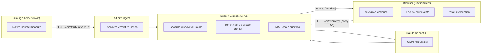

<div align="center">

# 🦅 Project Simurgh

**Zero-Trust Integrity API for Autonomous Agents and High-Stakes Proctoring**

_Detecting UI-redressing and behavioral spoofing without relying on screen capture._

[](https://github.com/Raoof128/Project-Simurgh/actions/workflows/stage-1-checks.yml)
[](https://nodejs.org)
[](https://docs.claude.com)
[](#13-status--license)
[](#13-status--license)

**[Read the Disclosure Paper →](https://raoufabedini.dev/projects/invisible-window-research)**

<br/>


</div>

> **Status: Stage 1 research MVP with Stage 1.5 validation pack.** This repository demonstrates a privacy-preserving behavioural integrity prototype and now includes reviewer-readiness docs for validation before Stage 2 planning. It does not collect video, audio, biometric data, typed answer content, pasted content, or personal identity data. See [PRIVACY.md](PRIVACY.md), [ETHICS.md](ETHICS.md), and [DISCLAIMER.md](DISCLAIMER.md).

---

## The Core Philosophy

In Persian mythology, the Simurgh is the ultimate protector of pure knowledge — an entity composed of thirty distinct birds acting as one.

**Project Simurgh** applies this principle to AI and enterprise safety. As frontier models gain "Computer Use" capabilities, they implicitly trust the visual UI. The research paper _The Invisible Window_ (Abedini, 2026) formalizes a structural vulnerability in this assumption. Project Simurgh serves as a decentralized "Shield of Shields," designed to restore ground-truth integrity to browser and OS environments by validating behavioral intent rather than visual output.

---

## Table of Contents

| #   | Section                                                                | Description                                       |
| --- | ---------------------------------------------------------------------- | ------------------------------------------------- |
| 1   | [The Threat: The Invisible Window](#1-the-threat-the-invisible-window) | The vulnerability class this project mitigates    |
| 2   | [The Simurgh Engine](#2-the-simurgh-engine)                            | Behavioral heuristic architecture                 |
| 3   | [System Architecture](#3-system-architecture)                          | Data-flow diagram and component topology          |
| 4   | [Socio-Economic Impact](#4-socio-economic-impact--democratic-access)   | Bandwidth-inclusive security and privacy ethics   |
| 5   | [Quick Start](#5-quick-start)                                          | Installation, configuration, and first run        |
| 6   | [API Reference](#6-api-reference)                                      | Endpoint specifications                           |
| 7   | [Cost & Latency](#7-cost--latency)                                     | Prompt-caching economics and response times       |
| 8   | [Security Considerations](#8-security-considerations)                  | HMAC audit chain and threat model                 |
| 9   | [Stage 1.5 Validation Pack](#9-stage-15-validation-pack)               | Reviewer-readiness and evidence map               |
| 10  | [Why Anthropic?](#10-why-anthropic)                                    | Strategic alignment with Constitutional AI        |
| 11  | [Strategic Roadmap](#11-strategic-roadmap-2026---2028)                 | Four-phase evolution from PoC to Sovereign Shield |
| 12  | [Contributors](#12-contributors)                                       | Project contributors                              |
| 13  | [Status & License](#13-status--license)                                | Current status and licensing                      |

---

## 1. The Threat: The Invisible Window

A 2026 disclosure (Abedini, R., _The Invisible Window: Exploiting OS-Level Display Affinity to Bypass WebRTC Proctoring Systems_) formalized an attack class against browser-based proctoring and AI UI-vision.

The attack utilizes documented OS-level APIs — Windows `SetWindowDisplayAffinity(WDA_EXCLUDEFROMCAPTURE)` and macOS `NSWindow.SharingType.none` — to render application windows that are fully visible to a physical operator but **produce zero pixels in any output of the W3C `getDisplayMedia()` capture API or AI vision pipelines**.

Consequently, visual verification at the browser layer is structurally broken. Whether mitigating academic dishonesty or preventing hostile overlays from deceiving autonomous agents, the visual channel cannot be inherently trusted.

---

## 2. The Simurgh Engine

The active heuristic engine bypasses the visual channel entirely, evaluating the underlying behavioral footprint. Every five seconds, the client environment samples a **behavioral telemetry window** — a lightweight JSON payload (~2 KB) containing:

| Field                  | Type    | Purpose                                 |
| ---------------------- | ------- | --------------------------------------- |
| `keystrokes`           | `int`   | Raw key-down count in window            |
| `chars_typed`          | `int`   | Characters entered (excludes modifiers) |
| `effective_wpm`        | `float` | Words per minute, normalized            |
| `focus_losses`         | `int`   | `blur` events on the exam tab           |
| `time_off_window_ms`   | `int`   | Cumulative time with focus elsewhere    |
| `pastes`               | `int`   | `paste` events intercepted              |
| `paste_payload_chars`  | `int`   | Total characters pasted                 |
| `max_idle_gap_ms`      | `int`   | Longest inter-keystroke interval        |
| `keydown_intervals_ms` | `int[]` | Raw inter-key timing array              |

This telemetry is securely transmitted to a Node/Express server, which interfaces with **Claude Sonnet 4.5** using a prompt-cached system prompt that encodes the threat model.

> **Illustrative scenario:** A screen recording appears pristine, yet telemetry reveals a 4-second focus loss followed by a 1,247-character paste. The visual feed is compromised. The Simurgh engine identifies this discrepancy and escalates the risk verdict accordingly.

### Explicit Limitations & Countermeasures

The behavioral engine cannot natively detect click-through GPU overlays (e.g., Cluely, Interview Coder), as they do not trigger focus-loss events. To address this vector, Simurgh deploys a native counterpart (`simurgh-helper`) that enumerates display-affinity flags directly at the OS level. See Section 3 for the data-flow integration.

> **Capability-uplift context:** The cross-platform exploits documented in the disclosure paper were built using Claude Opus 4.6 via Claude Code in a single research session by a student with no prior Win32 or ScreenCaptureKit experience — a self-contained capability-uplift case study directly relevant to Anthropic's RSP threshold work (see Paper, Section VIII-G).

---

## 3. System Architecture



### Component Summary

| Component                | Language          | Role                                                                       |
| ------------------------ | ----------------- | -------------------------------------------------------------------------- |
| **Browser Client**       | JavaScript        | Collects behavioral telemetry; renders verdict overlay                     |
| **Server**               | Node.js / Express | Routes telemetry to Claude; maintains HMAC audit chain                     |
| **Claude Sonnet 4.5**    | —                 | Evaluates behavioral windows against the encoded threat model              |
| **simurgh-helper**       | Swift (macOS)     | Native agent; enumerates `NSWindow.SharingType` flags via ScreenCaptureKit |
| **Instructor Dashboard** | HTML / SSE        | Real-time multi-session monitoring and audit export                        |

### Why Prompt Caching Matters

The system prompt encoding the threat model is ~700 tokens and does not change across windows. Using `cache_control: { type: "ephemeral" }` ensures every subsequent window is a cache read — approximately **90% cheaper** than a cold invocation.

---

## Simurgh Academic Shield

Stage 1 extends the core behavioural telemetry engine into a complete **privacy-first academic integrity workflow**.

**What it adds:**

| Capability         | Detail                                                                                |
| ------------------ | ------------------------------------------------------------------------------------- |
| Exam lifecycle     | `POST /api/exams` → join → privacy-accept → start → submit                            |
| Identity privacy   | Student IDs are SHA-256 hashed — raw names never stored                               |
| Local risk scoring | Weighted category model (paste, focus, typing, idle, affinity, helper, session)       |
| Claude narrative   | Called only on Warning/Critical; fail-open (local score stands if Claude unavailable) |
| Academic events    | Named taxonomy (BULK_PASTE, FOCUS_LOSS, CAPTURE_EXCLUDED_WINDOW, etc.)                |
| JSON report export | `GET /api/sessions/:id/report` — includes timeline, risk summary, audit validity      |
| Audit verification | `GET /api/audit/:id/verify` — HMAC chain integrity check                              |

**Privacy commitment:** Simurgh collects behavioural metadata only. No screen pixels, no webcam frames, no typed content, no paste content. Risk scores are heuristic-based. Any anomaly recommendation requires manual human review — Simurgh never makes automatic misconduct findings.

---

## Stage 1 Security Hardening

Simurgh Stage 1 is **privacy-preserving, tamper-evident, hardened, and auditable against the Stage 1 threat model**. It is not "unhackable" — no system is — but every documented gap has a deliberate countermeasure.

### Authentication boundaries

| Boundary                                                                     | Required                  | Mechanism                                                          |
| ---------------------------------------------------------------------------- | ------------------------- | ------------------------------------------------------------------ |
| Instructor APIs (`/api/sessions`, `/report`, `/audit/:id/verify`, SSE, etc.) | Bearer token              | `SIMURGH_INSTRUCTOR_TOKEN`, validated by `requireInstructorAuth`   |
| Native helper (`/api/affinity`)                                              | Shared secret header      | `SIMURGH_HELPER_SECRET`                                            |
| Student lifecycle (`privacy-accept`, `start`, `submit`)                      | HMAC session token        | Issued at `/api/exams/:id/join`, verified by `requireSessionToken` |
| Student telemetry (joined sessions)                                          | HMAC session token        | Bound to sessionId; rejected on mismatch                           |
| Student telemetry (anonymous demo)                                           | Replay guard + rate limit | No identity binding required                                       |

Four separate secrets in production: `SIMURGH_INSTRUCTOR_TOKEN`, `SIMURGH_HELPER_SECRET`, `SIMURGH_AUDIT_SECRET`, `SIMURGH_SESSION_SIGNING_SECRET`. The server refuses to start in non-demo mode if any are missing.

### Replay and tamper protection

Every joined-session telemetry POST carries `sequence` and `timestamp`. The server rejects:

- Duplicate or rolled-back sequences (`sequence_replay_or_rollback`)
- Timestamps more than 30 s in the past (`timestamp_stale`)
- Timestamps more than 5 s in the future (`timestamp_in_future`)
- Negative numbers, `NaN`, `Infinity`, or values more than 2× over the documented field max
- Payloads larger than 32 KB (`SIMURGH_JSON_LIMIT` configurable)

### Rate limits

| Endpoint                   | Limit                 | Key                  |
| -------------------------- | --------------------- | -------------------- |
| `/api/exams/:id/join`      | 10/min                | per IP               |
| `/api/affinity`            | 60/min                | per helper secret    |
| `/api/sessions`            | 60/min                | per instructor token |
| `/api/sessions/:id/report` | 20/min                | per instructor token |
| `/api/audit/:id/verify`    | 20/min                | per instructor token |
| `/api/telemetry`           | 3 burst / 1 per 2.5 s | per session          |

### HTTP security headers

`X-Frame-Options: DENY`, `X-Content-Type-Options: nosniff`, `Referrer-Policy: strict-origin-when-cross-origin`, `Permissions-Policy: camera=(), microphone=(), geolocation=()`, `Strict-Transport-Security` (production).

### Tamper-evident audit chain

Every academic event is appended to an HMAC-SHA256 linked chain. Any modification of a prior entry invalidates the signatures of every downstream entry. Verified end-to-end via `GET /api/audit/:id/verify`.

### Stage 1 Verification

Every push to `main` and every pull request runs the full Stage 1 quality gate as a GitHub Actions workflow ([.github/workflows/stage-1-checks.yml](.github/workflows/stage-1-checks.yml)) — same script, same checks. The badge at the top of this file reflects the current status of `main`.

Run the suite locally before pushing:

```bash
./scripts/check.sh              # full pre-push check (21 gates, ~7s)
./scripts/check.sh --quick      # pre-commit (skips server boot + chain self-test, ~3s)
./scripts/check.sh --fix        # auto-format with Prettier instead of check
./scripts/check.sh --verbose    # stream command output instead of writing to logs
```

The script enforces: Node ≥ 22, JS syntax, Prettier format, unit tests, privacy audit (CLI + composite field grep + forbidden npm packages), secret scan, tone check, `npm audit`, server boot + auth gates + security headers + replay rejection, audit chain build/verify round-trip, and git state. Failed steps write a tail of their log to `.simurgh_check_logs/`.

Individual checks can also be run directly:

```bash
node tools/privacy-audit.mjs                      # privacy audit
npm test                                          # 68 unit tests
node tools/verify-audit.mjs simurgh-audit-*.json  # verify an exported chain
npm run format:check                              # Prettier check
npm run format                                    # Prettier write
```

### Dashboard

- Instructor token is stripped from the URL on page load via `history.replaceState` (no leak into history or referrer)
- Report/verify calls use the `Authorization` header — no token in query string
- All dynamic rendering uses HTML-escaped strings; no unescaped untrusted data interpolation

### Honest limitations (from the research paper §VI-C)

- **Click-through overlays** (`WS_EX_TRANSPARENT`, `ignoresMouseEvents`) do not fire focus events. Pair Simurgh with the native helper (Countermeasure A).
- **Read-don't-paste workflows** — silent transcription at human WPM with no paste — cannot be detected from telemetry alone. Documented in `SECURITY.md`.
- **GPU-layer overlays** (DirectX/Metal hooks) — Stage 4 research track.

The privacy audit, tamper test, and replay test scripts MUST pass before any deployment to a shared environment. See `SECURITY.md` for the disclosure process.

---

## 4. Socio-Economic Impact & Democratic Access

Current proctoring standards (CodeSignal, ProctorU, Examity) are architected for high-bandwidth environments. Project Simurgh intentionally disrupts this paradigm by prioritizing **Bandwidth-Inclusive Security**.

### Bridging the Digital Divide

Traditional proctoring requires continuous, high-speed video streaming. This effectively excludes students in remote villages, developing nations, and rural regions (e.g., Regional Australia, the Global South) where bandwidth is a structural constraint.

**The Simurgh approach:** By transmitting lightweight behavioral JSON (~2 KB per window) instead of HD video, a student on a 3G connection maintains the same integrity rating as a student on fiber in Silicon Valley. The bandwidth requirement drops by approximately **three orders of magnitude**.

### Privacy-as-Code vs. Privacy-as-Surveillance

Platforms such as CodeSignal are increasingly scrutinized for invasive data collection practices. Project Simurgh's zero-visual approach eliminates the psychological burden of continuous observation — a factor that research indicates disproportionately affects neurodivergent and socioeconomically disadvantaged students.

### Cross-Platform Superiority over Legacy Lockdown Software

The industry's prevailing lockdown solution — Safe Exam Browser (SEB) — was originally designed for Windows and remains functionally constrained to that ecosystem. Its macOS and Linux support is incomplete, its mobile compatibility is non-existent, and its architecture has not evolved to address modern threat vectors such as display-affinity exploits or AI-driven UI spoofing. SEB represents a generation of security thinking built around _restricting the environment_ rather than _verifying behavior_.

Project Simurgh inverts this model. Because the integrity signal is derived from lightweight behavioral telemetry transmitted over a standard browser session, the system is inherently **platform-agnostic**:

| Platform     | SEB Support       | Simurgh Support                             |
| ------------ | ----------------- | ------------------------------------------- |
| Windows      | Partial (primary) | ✅ Full (browser-based telemetry)           |
| macOS        | Limited           | ✅ Full (browser + native `simurgh-helper`) |
| Linux        | Experimental      | ✅ Full (browser-based telemetry)           |
| iOS / iPadOS | ❌ None           | ✅ Roadmap (browser-based)                  |
| Android      | ❌ None           | ✅ Roadmap (browser-based)                  |
| ChromeOS     | ❌ None           | ✅ Roadmap (browser-based)                  |

By decoupling integrity verification from the operating system's lockdown capabilities, Simurgh enables a single, unified API to serve every device a student or agent might use — without requiring platform-specific client installations.

### Zero Client-Side Compute — Device Inclusivity by Design

Traditional proctoring platforms impose significant hardware demands: continuous video encoding, real-time screen capture processing, and local AI inference all require modern CPUs, dedicated GPUs, and substantial RAM. Students with older or lower-specification devices are systematically disadvantaged — or outright excluded.

Project Simurgh eliminates this barrier entirely. **All intelligence resides server-side.** The client's only responsibility is collecting lightweight behavioral events (keystrokes, focus changes, paste events) and transmitting a ~2 KB JSON payload every five seconds. Claude performs all analytical processing on Anthropic's infrastructure. As a result:

- **No video or images ever leave the student's device.** The system transmits only anonymized behavioral metadata — never pixels, never frames, never recordings of the student's environment.
- **No local AI inference is required.** The device does not need a GPU, does not need to run a machine learning model, and does not need to encode or decode video streams.
- **Any device with a browser can participate.** A student using a five-year-old laptop, a budget Chromebook, or even a mobile phone maintains the same integrity verification quality as a student on a high-end workstation. Hardware inequality does not translate into assessment inequality.

### Institutional Cost Reduction

Beyond software licensing, universities currently bear significant operational costs for examination integrity: hiring teams of **human invigilators**, booking **physical examination venues**, and managing the logistics of large-scale in-person supervision. A single mid-sized university can spend hundreds of thousands of dollars per semester on venue hire and casual invigilation staff alone.

Project Simurgh eliminates these line items entirely. By replacing physical supervision with a lightweight behavioral API, institutions can:

- Remove the need for dedicated examination halls and their associated booking, maintenance, and scheduling overhead.
- Eliminate per-session human invigilator costs — no recruitment, no training, no rostering.
- Reduce proctoring infrastructure costs by up to **85%** relative to traditional video-based remote systems through prompt caching.

This transforms integrity verification from a recurring operational expense into a low-cost, API-driven infrastructure dependency — enabling universities to scale examination capacity without scaling headcount or real estate.

### Public Health Resilience

Large-scale in-person examinations concentrate hundreds of individuals in enclosed venues for extended periods — creating significant epidemiological risk vectors during seasonal influenza outbreaks, respiratory pandemics (as demonstrated by COVID-19), and other communicable disease events. Institutions are frequently forced to choose between maintaining assessment schedules and protecting student and staff health.

Project Simurgh renders this trade-off obsolete. By enabling high-integrity remote examination without visual surveillance, institutions can maintain full assessment continuity while preserving safe social distancing. Students complete examinations from their own environments, eliminating the public health liability of physical congregation entirely. This positions behavioral integrity verification not merely as a cost optimization, but as a critical component of **institutional resilience infrastructure**.

---

## 5. Quick Start

### Prerequisites

- Node.js ≥ 22.0 (matches CI and `scripts/check.sh`)
- Anthropic API Key (for Claude integration)
- Xcode Command Line Tools (macOS — for building the native helper)

### Installation

```bash
git clone https://github.com/Raoof128/Project-Simurgh.git
cd Project-Simurgh
npm install
```

### Configuration

```bash
cp .env.example .env
```

| Variable                         | Required | Description                                                                                   |
| -------------------------------- | -------- | --------------------------------------------------------------------------------------------- |
| `ANTHROPIC_API_KEY`              | Yes\*    | Anthropic SDK key. If unset, server runs in demo mode (local heuristic).                      |
| `SIMURGH_HELPER_SECRET`          | Yes\*    | Shared secret for `simurgh-helper` authentication. Generate: `openssl rand -hex 32`           |
| `SIMURGH_AUDIT_SECRET`           | Yes\*    | HMAC key for the tamper-evident audit chain. Generate: `openssl rand -hex 32`                 |
| `SIMURGH_INSTRUCTOR_TOKEN`       | Yes\*    | Bearer token gating the instructor dashboard and SSE stream. Generate: `openssl rand -hex 24` |
| `SIMURGH_SESSION_SIGNING_SECRET` | Yes\*    | HMAC key for student session tokens. Generate: `openssl rand -hex 32`                         |
| `SIMURGH_MODEL`                  | No       | Model override. Default: `claude-sonnet-4-5`                                                  |
| `SIMURGH_ALLOWED_ORIGIN`         | No       | CORS origin restriction. Default: `*`                                                         |

_Required for production deployment. The server auto-generates ephemeral values for local development._

### Running the Server

```bash
npm start
```

The instructor dashboard is accessible at `http://localhost:3030/instructor`.

### Building the Native Helper (macOS)

```bash
cd tools/simurgh-helper
make
./simurgh-helper --session <SESSION_ID> --server http://localhost:3030 --secret "$SIMURGH_HELPER_SECRET"
```

### Screenshots

| Student Exam View                                                                                                                 | Instructor Dashboard                                                                                                       |
| --------------------------------------------------------------------------------------------------------------------------------- | -------------------------------------------------------------------------------------------------------------------------- |
|                                            |                            |
| _Real-time behavioral analysis with keystroke signature waveform, display-affinity monitoring, and Claude-powered risk verdicts._ | _Multi-session monitoring dashboard with per-session verdict history, helper status, and capture-invisible window counts._ |

---

## 6. API Reference

### `POST /api/telemetry`

Ingests the 5-second behavioral telemetry window from the browser client.

| Field            | Value                                                                                                                                                           |
| ---------------- | --------------------------------------------------------------------------------------------------------------------------------------------------------------- |
| **Content-Type** | `application/json`                                                                                                                                              |
| **Payload**      | JSON object: `{ keystrokes, chars_typed, effective_wpm, focus_losses, time_off_window_ms, pastes, paste_payload_chars, max_idle_gap_ms, keydown_intervals_ms }` |
| **Response**     | `200 OK` with a JSON risk result                                                                                                                                |

Example response:

```json
{
  "risk_level": "Safe",
  "reasoning": "Metadata-only telemetry stayed within normal behavioral thresholds."
}
```

`risk_level` may be `"Safe"`, `"Warning"`, or `"Critical"`.

### `POST /api/affinity`

Receives native OS display-affinity metrics from the `simurgh-helper` agent.

| Field            | Value                                                                                                      |
| ---------------- | ---------------------------------------------------------------------------------------------------------- |
| **Header**       | `x-simurgh-helper-secret: <SIMURGH_HELPER_SECRET>`                                                         |
| **Payload**      | JSON object containing an array of capture-excluded windows with process names, PIDs, and fidelity metrics |
| **Response**     | `200 OK`                                                                                                   |
| **Auth failure** | `401 invalid_helper_secret`                                                                                |

### `GET /api/sessions`

Returns all active and historical session metadata. Requires instructor token.

| Field        | Value                                              |
| ------------ | -------------------------------------------------- |
| **Header**   | `Authorization: Bearer <SIMURGH_INSTRUCTOR_TOKEN>` |
| **Response** | `200 OK` — JSON array of session objects           |

### `GET /api/audit/:sessionId`

Exports the full HMAC-chained audit trail for a given session. Requires instructor token.

### `GET /api/audit/:sessionId/verify`

Verifies the in-memory HMAC audit chain for a given session. Requires instructor token.

---

## 7. Cost & Latency

### Prompt Caching Economics

The system prompt encoding the threat model consists of ~700 tokens. As this prompt remains static across all telemetry windows within a session, Project Simurgh leverages Anthropic's `cache_control: { type: "ephemeral" }`.

| Metric                             | Value                    |
| ---------------------------------- | ------------------------ |
| System prompt size                 | ~700 tokens              |
| Cache hit rate (steady state)      | ~100% after first window |
| Cost reduction vs. cold invocation | ~90%                     |
| Estimated cost per 60-min session  | < $0.01                  |

### Latency

Telemetry evaluation occurs in real-time, with Claude API round-trips consistently resolving under 800ms. This ensures the instructor dashboard reflects behavioral anomalies within one telemetry cycle (5 seconds).

---

## 8. Security Considerations

### HMAC Audit Chain

Every verdict emitted by the server is appended to a tamper-evident audit chain. Each entry is signed with `HMAC-SHA256` using the `SIMURGH_AUDIT_SECRET`, and each signature incorporates the hash of the preceding entry — producing a blockchain-like chain of custody for all integrity decisions.

### Helper Authentication

The `simurgh-helper` native agent authenticates to the server via a shared secret transmitted in the `x-simurgh-helper-secret` HTTP header. The server rejects all affinity reports from unauthenticated agents.

### Threat Model Boundaries

| Vector                                      | Covered  | Mechanism                                             |
| ------------------------------------------- | -------- | ----------------------------------------------------- |
| Tab-switching + paste injection             | ✅       | Behavioral telemetry (focus loss + paste detection)   |
| `NSWindow.SharingType.none` overlays        | ✅       | `simurgh-helper` (ScreenCaptureKit enumeration)       |
| `SetWindowDisplayAffinity` overlays         | Planned  | Windows helper is Stage 2 work                        |
| Click-through/GPU overlays (no focus steal) | Partial  | Documented limitation; helper may not cover all cases |
| Pose-token injection (future)               | Research | Hardware-rooted attestation is future work            |

---

## 9. Stage 1.5 Validation Pack

Stage 1.5 is a validation, audit, documentation, and reviewer-readiness sprint. It does not add major Stage 2 runtime code.

| Review area               | Entry point                                                        |
| ------------------------- | ------------------------------------------------------------------ |
| Main reviewer pack        | [docs/STAGE_1_5_REVIEWER_PACK.md](docs/STAGE_1_5_REVIEWER_PACK.md) |
| Threat model              | [docs/THREAT_MODEL.md](docs/THREAT_MODEL.md)                       |
| Validation matrix         | [docs/VALIDATION.md](docs/VALIDATION.md)                           |
| Limitations               | [docs/LIMITATIONS.md](docs/LIMITATIONS.md)                         |
| Stage 2 architecture plan | [docs/STAGE_2_ARCHITECTURE.md](docs/STAGE_2_ARCHITECTURE.md)       |
| Resource plan             | [docs/RESOURCE_PLAN.md](docs/RESOURCE_PLAN.md)                     |
| Demo script               | [docs/DEMO_SCRIPT.md](docs/DEMO_SCRIPT.md)                         |
| Decisions                 | [docs/DECISIONS.md](docs/DECISIONS.md)                             |
| Risk register             | [docs/RISK_REGISTER.md](docs/RISK_REGISTER.md)                     |
| Reviewer checklist        | [docs/REVIEWER_CHECKLIST.md](docs/REVIEWER_CHECKLIST.md)           |
| Evidence folder rules     | [docs/evidence/stage-1/README.md](docs/evidence/stage-1/README.md) |

### What Stage 1 Proves

- Metadata-only behavioral telemetry can support a low-bandwidth academic integrity workflow.
- Joined sessions can enforce HMAC session tokens and replay protection.
- Local deterministic scoring can remain the official score while Claude provides optional narrative.
- Helper display-affinity telemetry can escalate risk when available.
- HMAC audit chains can provide tamper-evident review records.

### What Stage 1 Does Not Prove

- It does not prove production readiness.
- It does not fully solve GPU overlays or read-only cheating workflows.
- It does not provide hardware-rooted attestation.
- It does not replace institutional misconduct review.
- It does not provide complete cross-platform helper coverage.

Recommended local validation:

```bash
npm install
./scripts/check.sh
npm test
node tools/privacy-audit.mjs
npm audit --audit-level=high
git diff --check
```

---

## 10. Why AI Platforms Need Proof-Based Integrity
Frontier AI systems are moving into education, enterprise workflows, coding environments, browser automation, and high-stakes digital sessions.

Current trust infrastructure still relies heavily on surveillance: webcam monitoring, screen recording, lockdown browsers, biometrics, and human review. This model is invasive, bandwidth-heavy, difficult to scale globally, and still vulnerable to display-layer and agentic workflow blind spots.

Project Simurgh explores a different model: proof-based integrity.

Instead of verifying trust by watching the user, Simurgh verifies the session environment through signed, privacy-preserving integrity proofs.

This makes Simurgh relevant to AI education products, enterprise AI deployments, agentic browser workflows, assessment platforms, and safety-critical computer-use systems.

Research Origin
This project emerged from research into browser-based proctoring failures and frontier-AI-assisted capability uplift. Although the original research was framed around AI safety, Simurgh is designed as a vendor-neutral integrity layer for AI-era education, enterprise, and agentic workflows.


---

## 11. Strategic Roadmap (2026 - 2028)

Project Simurgh is evolving from a vulnerability demonstration into a comprehensive, enterprise-grade Integrity API.

### Phase 1: Vulnerability Formalization (Current)

- [x] Document the "Invisible Window" exploit class.
- [x] Develop the Simurgh heuristic proof-of-concept environment.
- [x] Demonstrate cross-platform UI redressing blindspots (macOS, Windows, Linux).
- [x] Implement `simurgh-helper` native agent for macOS (Swift / ScreenCaptureKit).
- [x] Add Stage 1.5 validation and reviewer-readiness pack.

### Phase 2: Autonomous Agent Hardening & Cross-Platform Expansion (Q3 – Q4 2026)

- [ ] Formalize the Heuristic Engine using advanced cluster compute.
- [ ] Red-team the heuristics against next-generation "Computer Use" agentic models.
- [ ] Publish the open-source Simurgh Integrity API draft for enterprise feedback.
- [ ] **Windows:** Develop `simurgh-helper-win` using `SetWindowDisplayAffinity` enumeration via Win32 API.
- [ ] **Linux:** Develop `simurgh-helper-linux` leveraging X11/Wayland compositor introspection.
- [ ] Design the Stage 2 Local Integrity Node and signed proof envelope.

### Phase 3: The Sovereign Shield — Unified Cross-Platform Release (2027)

- [ ] Roll out the Integrity API as a safety dependency for academic proctoring and enterprise "Computer Use" agents.
- [ ] Establish hardened OS environments natively immune to cross-platform redressing.
- [ ] **iOS / iPadOS:** Validate browser-based telemetry collection under Safari WebKit constraints.
- [ ] **Android:** Validate browser-based telemetry collection under Chrome/WebView constraints.
- [ ] **ChromeOS:** Certify compatibility with managed Chromebook environments used in education.
- [ ] Release unified cross-platform installer / deployment toolkit.

### Phase 3b: Delivery Modes — Browser & Native Application (2027)

Project Simurgh is designed to support two parallel delivery modes per platform to maximize institutional flexibility:

| Platform         | Browser (PWA)        | Native App                          | Native Helper                                  |
| ---------------- | -------------------- | ----------------------------------- | ---------------------------------------------- |
| **macOS**        | ✅ Current           | Roadmap — `.app` via MDM            | ✅ `simurgh-helper` (Swift / ScreenCaptureKit) |
| **Windows**      | ✅ Current           | Roadmap — `.msix` via GPO           | Roadmap — `simurgh-helper-win` (Win32 API)     |
| **Linux**        | ✅ Current           | Roadmap — `.deb` / `.rpm` / Flatpak | Roadmap — `simurgh-helper-linux` (X11/Wayland) |
| **iOS / iPadOS** | Roadmap — Safari PWA | Roadmap — Swift/SwiftUI (App Store) | Roadmap — embedded in native app               |
| **Android**      | Roadmap — Chrome PWA | Roadmap — Kotlin (Play Store)       | Roadmap — embedded in native app               |
| **ChromeOS**     | Roadmap — Chrome PWA | Roadmap — Android APK sideload      | N/A (browser telemetry sufficient)             |

**Browser-based delivery** provides zero-install access via the institution's LMS or exam portal — ideal for BYOD, remote exams, and developing regions. **Native applications** provide deeper OS integration, enabling the full `simurgh-helper` countermeasure suite (display-affinity scanning, process enumeration) alongside the behavioral telemetry client.

- [ ] **Browser PWA (all platforms):** Package the exam client as an installable Progressive Web App with offline telemetry buffering and service worker resilience.
- [ ] **macOS App:** Bundle `simurgh-helper` into a signed, notarized `.app` distributed via MDM for institutional deployment.
- [ ] **Windows App:** Package `simurgh-helper-win` as a signed `.msix` installer for enterprise group policy distribution.
- [ ] **Linux App:** Distribute as `.deb` / `.rpm` / Flatpak / Snap for managed university Linux labs.
- [ ] **iOS App:** Develop a native Swift/SwiftUI exam client with embedded behavioral helper and App Store distribution for managed iPad fleets.
- [ ] **Android App:** Develop a native Kotlin exam client with embedded behavioral helper and Play Store / managed Google Play distribution.

### Phase 4: Privacy-Preserving Visuals — The "Code-Video" Layer (2027 – 2028)

- [ ] **Edge-to-Token Processing:** Process video on the edge and convert physical movement into behavioral metadata. The server never receives raw video frames.
- [ ] **Pose-to-Code Translation:** Convert a webcam feed into skeletal coordinates and gaze-vectors. The server receives only "pose-tokens" that verify human presence and attention. _(Requires Hardware-Rooted Attestation to prevent pose-token injection attacks.)_
- [ ] **Zero-Knowledge Visuals:** Enable institutions to cryptographically prove a test was taken fairly without ever possessing a single pixel of the student's likeness.

---

## 12. Contributors

| Contributor            | Role                                                                                                                                                                                                                    |
| ---------------------- | ----------------------------------------------------------------------------------------------------------------------------------------------------------------------------------------------------------------------- |
| **Raouf Abedini**      | Project lead — vulnerability research, system architecture, full-stack implementation. Final-year Cybersecurity student, Macquarie University.                                                                          |
| **Claude (Anthropic)** | AI pair-programming partner — code review, architectural feedback, documentation refinement. Also used as the exploit development tool in the original disclosure (capability-uplift case study, Paper Section VIII-G). |

---

## 13. Status & License

**Status:** Research prototype and technical demonstrator. Stage 1 is complete as a bounded research MVP; Stage 1.5 provides validation and reviewer-readiness documentation; Stage 2 is planned. Not currently deployed in production.

**License:** MIT © 2026 Raouf Abedini
